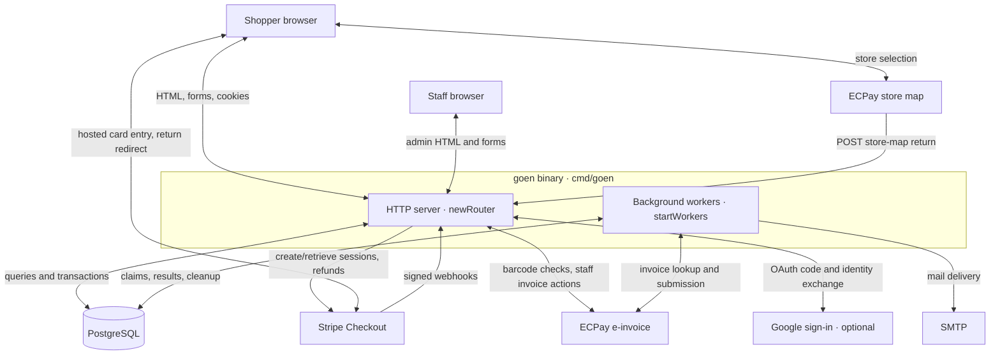
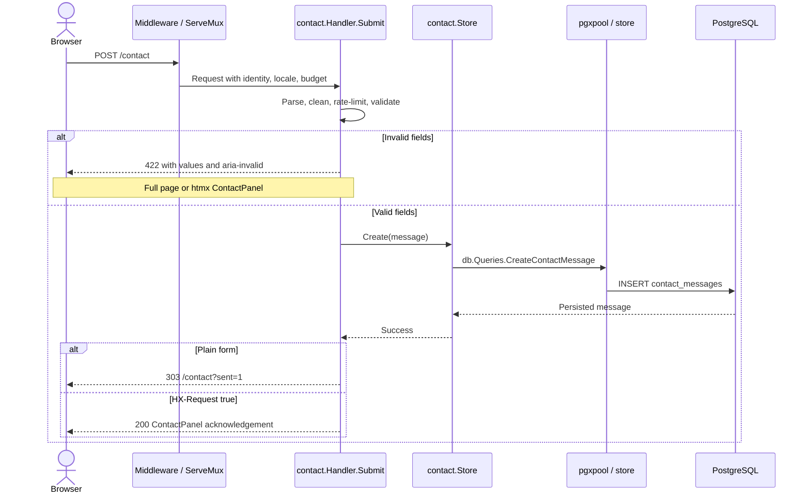
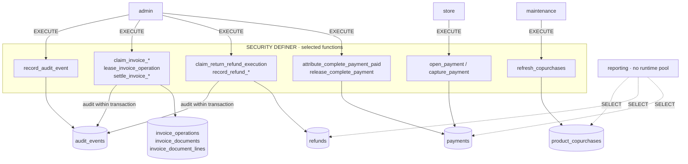
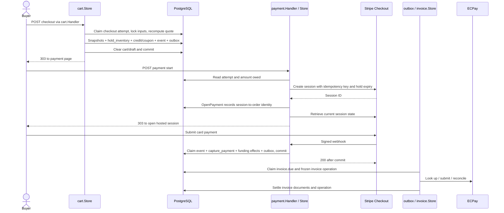
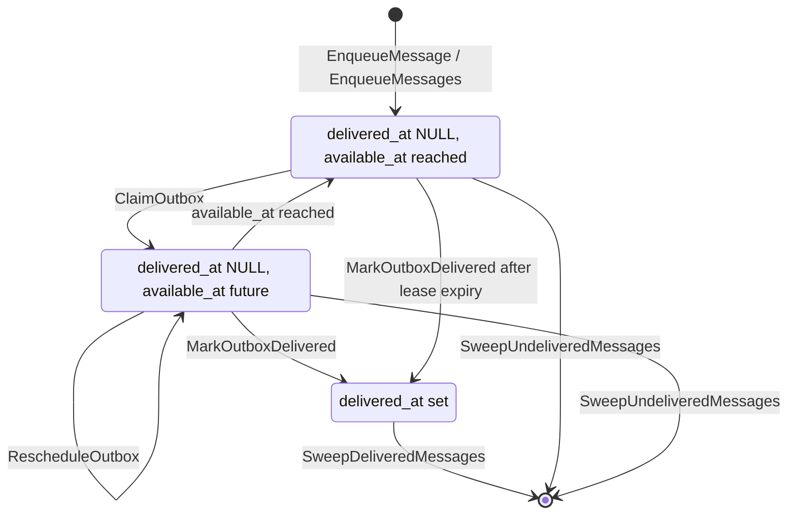
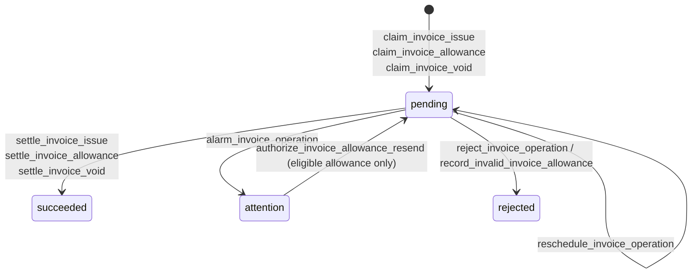

# Architecture

goen is one Go binary serving the storefront, customer accounts, and back office, with background workers in the same process. PostgreSQL owns durable commerce state and enforces concurrent-write rules; Go coordinates requests and provider work. HTML is rendered on the server. This document explains that structure before a reader enters the code; setup belongs in [CONTRIBUTING.md](CONTRIBUTING.md).

## System context

The deployment unit is one binary next to PostgreSQL, configured through `GOEN_*` variables in [.env.example](.env.example). [`main.run`](cmd/goen/main.go) composes it; [`newRouter`](cmd/goen/server.go) registers its HTTP surfaces. Arrows below name exchanges, including browser redirects and provider callbacks.

ECPay invoicing and the store map have separate configuration and request paths: [`invoice.Gateway`](internal/invoice/ecpay.go) handles invoices; [`cart.StoreMap`](internal/cart/ecpaymap.go) prepares the browser picker and validates its return. `payment.Gateway` creates hosted sessions and verifies webhooks in [payment/stripe.go](internal/payment/stripe.go).

## Technology choices

The reasons below follow the linked implementation or repository contract. Runtime dependencies are pinned in [go.mod](go.mod); command-line generators, migration tooling, and axe-core are pinned in [Makefile](Makefile).

| Choice | Role in goen | Why |
| --- | --- | --- |
| Go `net/http` | Routing, middleware, request contexts, HTTP lifecycle | [`newRouter`](cmd/goen/server.go) composes one `ServeMux` and explicit feature dependencies; [`newServer`](cmd/goen/main.go) owns transport limits. |
| `github.com/a-h/templ` | Typed page/component rendering | [Templates](internal/ui/pages) compile into Go; `templ-check` in [Makefile](Makefile) checks generated output against source. |
| htmx | HTML fragment enhancement | [`ContactPanel`](internal/ui/pages/contact.templ) retains a plain form action/method while adding fragment replacement; the server owns the operation in both modes. |
| `github.com/jackc/pgx/v5` | PostgreSQL connections, pools, transactions | [`openPool`, `openAdminPool`, `openMaintenancePool`](cmd/goen/main.go) fix each pool's role and statement budget. |
| sqlc | SQL-to-Go query generation | [sqlc.yaml](sqlc.yaml) compiles feature-owned SQL into typed `db.Queries`, keeping the executed SQL reviewable beside its feature. |
| `github.com/golang-migrate/migrate/v4` | Numbered SQL migration execution | [Makefile](Makefile) exposes explicit up/down commands; CI checks a complete migration round trip. |
| PostgreSQL roles + `SECURITY DEFINER` | Restricted business mutations | [Schema grants and functions](migrations/001_initial_schema.up.sql) make payment, refund, invoice, and ledger rules apply across all callers. |
| `github.com/stripe/stripe-go/v86` / Checkout | Hosted card entry, payment events, refunds | [`StartSession`](internal/payment/stripe.go) pins card methods and binds expiry to reserved stock; local payment rows anchor webhook attribution. |
| ECPay clients in `invoice` and `cart` | E-invoices, mobile barcodes, store selection | [`invoice/recovery.go`](internal/invoice/recovery.go) reconciles provider documents; [`ecpaymap.go`](internal/cart/ecpaymap.go) carries the configured logistics contract. |
| `golang.org/x/crypto/argon2` | Customer and staff password hashing | [`account.HashPassword`](internal/account/account.go) uses salted Argon2id with explicit memory/work parameters; staff use the same account credentials. |
| Go HMAC-SHA1 / AES-GCM; `rsc.io/qr` | Staff TOTP, encrypted secrets, enrollment QR | [`twofactor`](internal/twofactor) implements authenticator-compatible codes and replay checks; QR rendering supplies the provisioning URI. TOTP itself is implemented with the standard library. |
| Go `log/slog` | Request, worker, and query diagnostics | [`requestLog`](cmd/goen/middleware.go) and [`slowQueryTracer`](cmd/goen/slowquery.go) attach request identity; slow-query logs name SQL without exposing arguments. |
| `testcontainers-go` + `modules/postgres` | PostgreSQL integration fixtures | [`dbtest.Start`](internal/db/dbtest/dbtest.go) applies real migrations so tests exercise constraints, grants, and concurrent writes. |
| Chrome/Chromium + axe-core | Browser layout/accessibility gate | [`check-layout`](Makefile) and [browser probes](scripts/check-layout.mjs) measure rendered pages, keyboard interactions, and accessibility findings. |

[`assets`](assets/assets.go) embeds CSS, fonts, htmx, and the application script with content-versioned URLs. CSS is authored in `base.css` and `app.css`; the browser enhancement is [goen.js](assets/js/goen.js). [CONTRIBUTING.md](CONTRIBUTING.md) establishes plain forms and authored CSS as project boundaries.

## Runtime composition

[`run`](cmd/goen/main.go) calls `loadConfig`, validates runtime/provider posture, creates mail and provider clients, opens and pings the pools, builds the router, starts workers, and serves HTTP. SIGINT/SIGTERM cancels the shared context; HTTP gets a bounded drain and workers finish before pools close. Migrations run through explicit tooling, outside binary startup.

| Pool constructor / role | Maximum connections | SQL statement budget | Users |
| --- | --- | --- | --- |
| `openPool` / `store` | 25 | 15 seconds | Storefront, account authentication, outbox, customer-data sweeps. |
| `openAdminPool` / `admin` | 10 | 30 seconds | Back-office stores, invoice operations, media cleanup. |
| `openMaintenancePool` / `maintenance` | 2 | 5 minutes | Co-purchase refresh. |

Each pool assigns its role when connecting. [`StorefrontConfig` and `BackOfficeConfig`](cmd/goen/server.go) feed `newRouter`, which calls `storefrontRoutes` and `backOfficeRoutes`. Back-office business handlers use `admin`; their shared session authentication still reads through `store`. `reporting` is a schema role with no runtime pool.

### Incoming middleware order

[`newServer`](cmd/goen/main.go), [`newRouter`](cmd/goen/server.go), and [`withRequestTracing`](cmd/goen/middleware.go) establish this order, outermost first:

1. `ratelimit.Proxies.Resolve` → `withRequestID` → `requestLog` → `recoverPanic`.
2. `web.Compress` → `securityHeaders` → `web.RefuseUnstorableText` → `crossOriginProtection`.
3. `withStorefrontRequestBudget` → `onlyVisitorPaths(customers.Authenticate)` → `onlyVisitorPaths(basket.WithCount)` → `onlyVisitorPaths(withLocale)`.
4. `withNoStore` → `withSiteOrigin` → `withStaffEntrance` → `withTopNav` → `withBanner`.
5. `http.ServeMux` → route-specific access/rate-limit guards → feature handler.

`onlyVisitorPaths` skips static assets, media, probes, webhooks, and the favicon. Navigation/banner middleware has its own applicability checks. The visitor request budget includes `/admin`; `withNoStore` covers signed-in responses, private/token routes, and writes. These conditions are defined in [middleware.go](cmd/goen/middleware.go).

### Every background loop

[`startWorkers`](cmd/goen/main.go) starts up to nine loops under the process context. Newsletter delivery is an outbox handler; refund recovery is initiated through staff actions.

| Loop | Pool | Work |
| --- | --- | --- |
| [`outbox.Store.Run`](internal/outbox/outbox.go) | `store`; invoice handoff uses `admin` | Deliver mail/account/newsletter topics and hand off invoice obligations. |
| [`outbox.Store.SweepForever`](internal/outbox/outbox.go) | `store` | Remove delivered and undelivered messages past retention. |
| [`cart.Store.SweepForever`](internal/cart/sweeper.go) | `store` | Release eligible expired reservations and cancel lapsed unpaid orders. |
| [`cart.Store.SweepAttemptsForever`](internal/cart/sweeper.go) | `store` | Remove old checkout attempts and order-access grants. |
| [`cart.Store.SweepDraftsForever`](internal/cart/sweeper.go) | `store` | Remove stale checkout drafts. |
| [`account.Store.SweepSessionsForever`](internal/account/store.go) | `store` | Remove expired sessions and old reset tokens. |
| [`media.Store.SweepForever`](internal/media/sweeper.go) | `admin` | Remove unreferenced uploads after their grace period. |
| [`invoice.Store.ReconcileForever`](internal/invoice/recovery.go) | `admin` | Reconcile invoice operations when the gateway is enabled. |
| [`recommend.Store.RefreshForever`](internal/recommend/store.go) | `maintenance` | Rebuild co-purchase data under an advisory lock. |

## One form request: `POST /contact`

[`contact.Handler.Submit`](internal/contact/handler.go) illustrates the form contract with an actual route. Validation precedes persistence; `respond` chooses a full page or `ContactPanel` using `web.IsHTMX`.

[`contact.Store.Create`](internal/contact/store.go) calls [CreateContactMessage](internal/contact/query.sql). [`ContactPanel`](internal/ui/pages/contact.templ) preserves submitted fields; [`components.Input` / `Textarea`](internal/ui/components/components.templ) emit `aria-invalid` from `FieldProps.Invalid`. This route returns `429` for rate limiting and `500` with retained values for storage failure; database errors are not all field-validation errors.

## Code organisation and imports

[CONTRIBUTING.md](CONTRIBUTING.md#change-it) establishes feature packaging: handlers, stores, SQL, and tests live together. Handlers call stores; stores use `db.Queries` and may return `ui/pages` view models directly. `cmd/goen` wires the dependencies. [`sqlc.yaml`](sqlc.yaml) maps each feature's `query.sql` into `internal/db`; [`make gen`](Makefile) turns UI and email `.templ` sources into `*_templ.go`.

[#1020](../../issues/1020) rules the conventions and staged moves: shared domain vocabulary belongs in leaf packages; UI should not import packages owning handlers or queries; extraction is justified by another consumer. These are the agreed direction, not a claim that every move has landed. Today `product` owns the product page, `cart` owns customer order pages, and `returns` combines policy and customer handlers; `ui/pages/admin` still imports `returns` ([current imports](internal/ui/pages/admin/returns.go)).

Every Go package directory, including test-support and integration-only directories, is listed below. `internal/ui` and `internal/admin` also organise subdirectories; the latter's own Go files are cross-desk tests.

| Package | Responsibility |
| --- | --- |
| [`cmd/goen`](cmd/goen) | Configuration, composition, routes, middleware, workers, process lifecycle. |
| [`assets`](assets) | Embedded assets, versioned URLs, asset compression, media URL selection. |
| [`internal/account`](internal/account) | Identity, passwords, sessions, profiles, addresses, Google sign-in, customer pages. |
| [`internal/admin`](internal/admin) | Cross-desk integration and pagination tests. |
| [`internal/admin/access`](internal/admin/access) | Staff/admin guards, TOTP step-up, refusal pages. |
| [`internal/admin/access/accesstest`](internal/admin/access/accesstest) | Shared tests that desk routes refuse outsiders. |
| [`internal/admin/admintest`](internal/admin/admintest) | Shared back-office integration fixtures and helpers. |
| [`internal/admin/audit`](internal/admin/audit) | Audited transactions, action vocabulary, audit-history pages. |
| [`internal/admin/campaigns`](internal/admin/campaigns) | Sale campaigns and their merchandise. |
| [`internal/admin/content`](internal/admin/content) | Hero, banner, FAQ, and newsletter authoring. |
| [`internal/admin/coupons`](internal/admin/coupons) | Coupon creation and administration. |
| [`internal/admin/customers`](internal/admin/customers) | Customer lookup, account/order information, warranty administration. |
| [`internal/admin/feedback`](internal/admin/feedback) | Reviews, questions, and contact-message handling. |
| [`internal/admin/health`](internal/admin/health) | Pool health, unresolved work, reconciliation controls. |
| [`internal/admin/invoicing`](internal/admin/invoicing) | Staff invoice issue, void, and correction actions. |
| [`internal/admin/loyalty`](internal/admin/loyalty) | Membership tiers and store-credit administration. |
| [`internal/admin/orders`](internal/admin/orders) | Dashboard, order desk, shipments, fulfillment, timelines. |
| [`internal/admin/products`](internal/admin/products) | Products, variants, and product images. |
| [`internal/admin/refunds`](internal/admin/refunds) | Card/credit payouts and before-shipment cancellations. |
| [`internal/admin/refundstate`](internal/admin/refundstate) | Shared refund statuses and refused/incomplete outcomes. |
| [`internal/admin/reports`](internal/admin/reports) | Sales reports over selected periods. |
| [`internal/admin/returns`](internal/admin/returns) | Return assessment, inspection, decisions, refund initiation. |
| [`internal/admin/shipping`](internal/admin/shipping) | Shipping methods, destinations, zones, surcharges. |
| [`internal/admin/staff`](internal/admin/staff) | Staff roster, permissions, invitations, lost-factor removal. |
| [`internal/admin/stock`](internal/admin/stock) | Stock adjustments, low-stock views, movement history. |
| [`internal/admin/taxonomy`](internal/admin/taxonomy) | Brands, categories, and category images. |
| [`internal/carrier`](internal/carrier) | Parcel-carrier identities and rules. |
| [`internal/cart`](internal/cart) | Baskets, checkout, holds, order access/cancellation/reorder, pickup flow. |
| [`internal/catalog`](internal/catalog) | Listings, search, comparisons, deals, campaign browsing. |
| [`internal/contact`](internal/contact) | Contact-form validation and stored messages. |
| [`internal/db`](internal/db) | Generated queries/types and schema-conformance tests. |
| [`internal/db/dbtest`](internal/db/dbtest) | PostgreSQL testcontainers and migration fixtures. |
| [`internal/destination`](internal/destination) | Closed shipping-destination vocabulary. |
| [`internal/email`](internal/email) | Mail content, templ rendering, SMTP/log transports. |
| [`internal/fieldrule`](internal/fieldrule) | Browser field constraints aligned with server validation. |
| [`internal/health`](internal/health) | Public liveness and database-readiness probes. |
| [`internal/home`](internal/home) | Homepage and shared navigation/banner reads. |
| [`internal/i18n`](internal/i18n) | Application wording, locale detection, translated labels. |
| [`internal/invoice`](internal/invoice) | ECPay clients, durable invoice operations, recovery, documents. |
| [`internal/layoutcheck`](internal/layoutcheck) | Tests protecting browser-gate configuration. |
| [`internal/loyalty`](internal/loyalty) | Customer points balance and redemption. |
| [`internal/media`](internal/media) | Upload validation/storage, renditions, serving, orphan cleanup. |
| [`internal/money`](internal/money) | Currency parsing, bounds, formatting. |
| [`internal/newsletter`](internal/newsletter) | Subscription confirmation/unsubscription and delivery data. |
| [`internal/order`](internal/order) | Fulfillment states, order events, order-number vocabulary. |
| [`internal/ordernotice`](internal/ordernotice) | Terminal-order mail with recipients resolved at delivery. |
| [`internal/outbox`](internal/outbox) | Durable enqueueing, leasing, retry, delivery, retention. |
| [`internal/payment`](internal/payment) | Stripe attempts, Checkout, signed webhook settlement. |
| [`internal/pgerr`](internal/pgerr) | PostgreSQL error classification by code/constraint. |
| [`internal/pickup`](internal/pickup) | Convenience-store chains and pickup rules. |
| [`internal/product`](internal/product) | Product detail, reviews, questions, restock subscriptions. |
| [`internal/ratelimit`](internal/ratelimit) | In-memory limits and trusted-proxy client addresses. |
| [`internal/recommend`](internal/recommend) | Co-purchase projection refresh. |
| [`internal/returns`](internal/returns) | Customer return requests and eligibility rules. |
| [`internal/shoptime`](internal/shoptime) | Shop-zone dates, times, calendar calculations. |
| [`internal/site`](internal/site) | Information/policies, sitemap, locale switching, 404 pages. |
| [`internal/twofactor`](internal/twofactor) | TOTP enrollment, encrypted secrets, verification, session step-up. |
| [`internal/ui/components`](internal/ui/components) | Reusable controls and presentation components. |
| [`internal/ui/icons`](internal/ui/icons) | SVG icons and category-icon selection. |
| [`internal/ui/layouts`](internal/ui/layouts) | Shared document head, page chrome, layout context. |
| [`internal/ui/pages`](internal/ui/pages) | Storefront/account templates and view models. |
| [`internal/ui/pages/admin`](internal/ui/pages/admin) | Back-office templates and view models. |
| [`internal/warranty`](internal/warranty) | Warranty registration for purchased units. |
| [`internal/web`](internal/web) | Rendering, forms, pagination, compression, text/HTTP helpers. |

## Data authority

The following selected write paths come from [001_initial_schema.up.sql](migrations/001_initial_schema.up.sql). `store` and `admin` have no direct writes to payment, refund, invoice, or audit records; granted `SECURITY DEFINER` functions own those operations. Ordinary feature tables retain their own table/column grants.

`reporting` excludes sensitive account/delivery data and outbox/invoice-operation payloads. The schema owner applies migrations. [`audit.Run` / `audit.In`](internal/admin/audit/audit.go), or the privileged function owning an operation, commit staff changes with their audit evidence. `audit_events_append_only` preserves the trail while allowing actor clearing during account erasure.

The [schema](migrations/001_initial_schema.up.sql) enforces `orders_fulfillment_status_known`, `orders_legal_transition`, `product_variants_stock_non_negative`, `store_credit_never_negative`, and `refunds_within_capture`. Foreign keys and unique indexes preserve identities and retry deduplication. [`order.FulfillmentStatus.Next`](internal/order/order.go) mirrors legal fulfillment edges; `TestNextIsTheTransitionsTheTriggerAllows` in [transition tests](internal/admin/orders/transition_integration_test.go) checks agreement.

[`cart.Store.placeOrder`](internal/cart/store.go) snapshots lines, prices, shipping terms, addresses, and invoice preferences. `committed_orders` includes non-cancelled orders past pending or with a successful payment; `settled_orders` also includes cancelled orders and freezes totals/lines. Fulfillment, payments, refunds, and invoice operations therefore retain separate statuses.

Feature `query.sql` files are the authored query source; [`sqlc.yaml`](sqlc.yaml) lists them. Migration `001` is amended in place only before real shop data exists; the first production deployment freezes it and subsequent changes use numbered migrations ([migration policy](CONTRIBUTING.md#what-goen-assumes)).

Search uses bounded escaped `ILIKE` patterns ([catalog/query.sql](internal/catalog/query.sql)); co-purchases are a derived projection rebuilt by `refresh_copurchases`. Uploaded source images live in `media_objects`; [`media.renderer`](internal/media/render.go) generates width renditions into a bounded process cache. Image keys also address embedded assets, so catalogue image references are not foreign keys to `media_objects`.

## Checkout, payment, and stock

A cart is mutable intent. [`placeOrder`](internal/cart/store.go) creates the purchase snapshot and reservation in one local transaction; a subsequent payment POST creates the remote Checkout Session. This sequence shows the successful new-session path; existing attempts are resumed separately.

`claimCheckoutKey` makes repeated placement find the prior order; locked recomputation must match the confirmed quote ([cart/store.go](internal/cart/store.go)). `hold_inventory` subtracts availability when reserving; dispatch consumes/splits reservations without a second stock debit. Expiry releases only eligible unpaid holds, preserving committed, zero-owed, and unresolved-payment orders ([cart/sweeper.go](internal/cart/sweeper.go), [schema functions](migrations/001_initial_schema.up.sql)).

The hold is 60 minutes; a new Stripe session must start within 29 minutes so Stripe's minimum lifetime fits inside it. `StartSession` pins card methods and `ExpiresAt` to the hold ([cart constants](internal/cart/cart.go), [payment limits](internal/payment/payment.go), [Stripe adapter](internal/payment/stripe.go)). After remote creation, failed local admission triggers expiration/recovery; `resume` retrieves current provider state before redirecting ([payment/handler.go](internal/payment/handler.go)).

The browser return is navigation, not payment evidence. `processWebhook` claims the event and applies its effects in one transaction; `webhookTx.Capture` attributes it through goen's own payment row, checks amount/currency, and calls `capture_payment`. `CompleteFunding` records the paid event, rewards, and receipt; `webhookTx.Capture` also calls `invoice.EnqueueDue` in that transaction ([payment/store.go](internal/payment/store.go), [payment/query.sql](internal/payment/query.sql)). Zero-owed orders skip Stripe; full credit covering a positive total queues invoice work during checkout and staff later advances fulfillment.

### Cancellation, returns, and invoice correction

[`admin/orders`](internal/admin/orders) records parcels and shipped quantities; [`returns`](internal/returns) accepts requests against shipped goods. [`admin/returns`](internal/admin/returns) freezes the assessed payout and separately records inspection/restock. Approval is not payment; completion posts no stock. [`refunds/payout.go`](internal/admin/refunds/payout.go) retries outstanding card/credit sources and records the refunded event only after both settle.

For a staff refund before shipment, [`RefundBeforeShipment`](internal/admin/refunds/beforeshipment.go) persists the attempt, tries invoice correction, pays the outstanding sources, then performs guarded cancellation and stock release. An invoice error does not stop the payout; unresolved correction can still block final cancellation.

[`CorrectForCancellation`](internal/invoice/cancellation.go) finishes an in-flight issue and voids a live uniform invoice within ECPay's `VoidDeadline` when no allowance prevents voiding. When the window has passed or an existing allowance prevents voiding, `FileCancellationAllowance` files an online-consent allowance after payout. The buyer must agree before the allowance becomes a settled document; cancellation can proceed once the allowance has been sent under the database guard. `sendAllowance` and `awaitBuyer` in [recovery.go](internal/invoice/recovery.go) preserve that distinction.

Customer cancellation of a pending order paid entirely by store credit follows [`cart.CancelOrder`](internal/cart/cancel.go): credit reversal and `invoice.EnqueueVoidDue` commit together. `ClaimVoidDue` can claim a void within its window; a non-voidable invoice remains a staff health task, rather than automatically following the staff allowance workflow.

## Outbox and invoice lifecycles

### Outbox: delivery conditions, not a status enum

[`outbox_messages`](migrations/001_initial_schema.up.sql) stores `delivered_at`, `available_at`, and `attempts`. The diagram's nodes are conditions: deferred includes both a delivery lease and retry backoff. Enqueue queries live in [cart/query.sql](internal/cart/query.sql); delivery and retention queries live in [outbox/query.sql](internal/outbox/query.sql).

[`Store.deliver` and `reschedule`](internal/outbox/outbox.go) use `SKIP LOCKED` claims, leases, bounded handler execution, and backoff. After eight attempts, stuck messages retry daily; delivered and undelivered retention are each 30 days with different starting timestamps. `(topic, dedupe_key)` suppresses duplicates while its row exists. A crash after an external send but before stamping delivery can repeat the send: this is at-least-once delivery with bounded retention.

### Invoice operations: durable provider reconciliation

For an invoice still owed, the `invoice.due` handler claims an `invoice_operations` row; satisfied or cancelled obligations can complete without a new claim. Outbox handoff and provider settlement are separate outcomes. [`ClaimDue`](internal/invoice/store.go) freezes the request before network work. Staff invoice actions can also claim operations directly. The diagram uses the exact values of `invoice_operations_status_known` and function names from the [schema](migrations/001_initial_schema.up.sql).

[`ReconcileOnce`](internal/invoice/recovery.go) leases due `pending` operations. `processIssue` looks up provider truth before submission and verifies identity, amount, and itemization before settlement. Outages remain pending with backoff; mismatched facts enter `attention`, which automatic leasing excludes. `succeeded` and `rejected` preserve the completed operation's evidence.

Allowance consent is asynchronous: an empty lookup after sending does not permit another send. `awaitBuyer` waits through the consent window; `authorize_invoice_allowance_resend` is a narrowly checked staff action, not a general `attention` retry. Cancellation handoff may find no further operation due ([invoice/cancellation.go](internal/invoice/cancellation.go), [recovery.go](internal/invoice/recovery.go)).

## Failure handling and operating limits

| Failure/boundary | Implemented response and evidence |
| --- | --- |
| Duplicate checkout or webhook | `claimCheckoutKey` resolves the prior order; `processWebhook` claims event/effect atomically ([cart store](internal/cart/store.go), [payment store](internal/payment/store.go)). |
| Database failure during webhook | Return `500` so Stripe retries; safely identified but unappliable events become durable alarms and receive `200` ([Webhook](internal/payment/handler.go)). |
| Uncertain payment/refund result | Preserve durable identity and reconcile; staff recovery lives in [health/reconcile.go](internal/admin/health/reconcile.go) and [refunds/payout.go](internal/admin/refunds/payout.go). |
| Provider disabled | Card, invoice/barcode, pickup, and Google surfaces follow their configured availability ([server.go](cmd/goen/server.go)); live Stripe requires secure cookies and production invoicing ([provider_posture.go](cmd/goen/provider_posture.go)). |
| SMTP/TOTP missing in secure mode | `prepareRuntimePosture` refuses startup; development mail logging is an explicit alternative ([main.go](cmd/goen/main.go)). |
| Database/worker trouble | `/healthz` checks process liveness; `/readyz` checks store/admin databases; [`admin/health`](internal/admin/health) exposes pools and unresolved work. |
| Workload growth | In-memory rate limits and fixed pools assume one instance; media shares database storage/reads, and search uses `ILIKE` ([operating assumptions](CONTRIBUTING.md#what-goen-assumes)). |

## Security boundaries

Staff authenticate as accounts: [`HashPassword` / `VerifyPassword`](internal/account/account.go) use Argon2id. [`access.Control.RequireStaff`](internal/admin/access/access.go) requires staff identity and configured TOTP step-up, returning `404` to signed-out visitors and ordinary customers; administrator-only operations add `RequireAdmin`. [`twofactor.Verify`](internal/twofactor/totp.go) rejects replayed steps; [encrypted secrets](internal/twofactor/crypt.go) use AES-256-GCM.

[`account`](internal/account/account.go) uses opaque session tokens, persisted as hashes by [account/store.go](internal/account/store.go), and `__Host-` secure, HttpOnly cookies in secure mode. [`crossOriginProtection`](cmd/goen/middleware.go) uses Go's origin defence with a precise configured store-map return bypass; Stripe authentication comes from webhook signatures. [`securityHeaders`](cmd/goen/middleware.go) and [`policyWith`](cmd/goen/server.go) set CSP and narrow form destinations.

[`ratelimit`](internal/ratelimit) limits sensitive routes in memory; `Proxies.Resolve` trusts forwarded client addresses only from configured proxies. Database roles limit SQL authority independently of the signed-in user's role. Ownership checks still belong to handlers/stores; possessing the `store` connection does not establish ownership of an order.

## Language, money, and time

[`i18n`](internal/i18n) declares application wording in both languages; locale detection gives explicit preference priority over `Accept-Language`. Shop copy uses authored translations. Orders save their locale for later mail ([cart/store.go](internal/cart/store.go)); `TestNoChromeStringIsHardCoded` guards application-text ownership ([hardcoded_test.go](internal/i18n/hardcoded_test.go)).

Amounts are integer cents bounded by the schema; [`money`](internal/money/money.go) centralises parsing and TWD formatting. [`shoptime`](internal/shoptime/shoptime.go) uses `Asia/Taipei` with embedded zone data; SQL `shop_day` uses the same calendar. Host timezone therefore does not choose the date shown on an order or interpreted from an ECPay timestamp.

## Testing and CI

[verify.yml](.github/workflows/verify.yml) defines these jobs; [Makefile](Makefile) owns their commands. The layers catch different failures.

| Job / test layer | What it checks |
| --- | --- |
| `ci-policy` | Workflow syntax and fail-closed gate contracts through `workflow-check`. |
| `commit-attribution` | Commit metadata against the repository attribution policy. |
| `verify` | Formatting, templ/sqlc drift, migration lint, vet, dead code, lint, production/integration builds, shuffled race-enabled unit/handler tests. |
| `schema` | Real PostgreSQL integration via [dbtest](internal/db/dbtest), schema conformance, concurrent-write behaviour, migration up/down/up. |
| `layout` | Running server plus Chrome at 375/768/1024/1440 px, interaction probes, axe-core findings against the accepted baseline. |
| `vulnerabilities` | Reachable Go dependency vulnerabilities through `govulncheck`. |
| CodeQL `analyze` | Go and Actions analysis in [codeql.yml](.github/workflows/codeql.yml). |

`TestEveryCheckConstraintIsExercised` and `TestEveryDefinerWrittenTableIsRevoked` derive database obligations from the catalogue ([coverage tests](internal/db/coverage_integration_test.go)). `TestTwoOrdersCannotTakeTheSameLastUnit` and `TestRefundsCannotRacePastCapture` exercise concurrency ([cart tests](internal/cart/integration_test.go), [rule tests](internal/db/rules_integration_test.go)). `TestEveryFormWorksWithScriptingOff` checks form structure ([writeface_test.go](internal/ui/pages/writeface_test.go)); browser execution is separate evidence.
