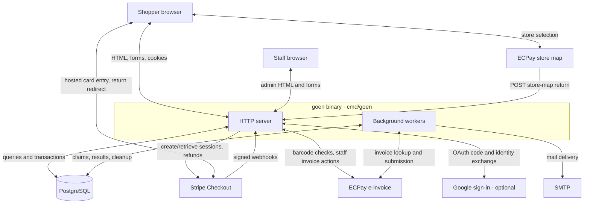
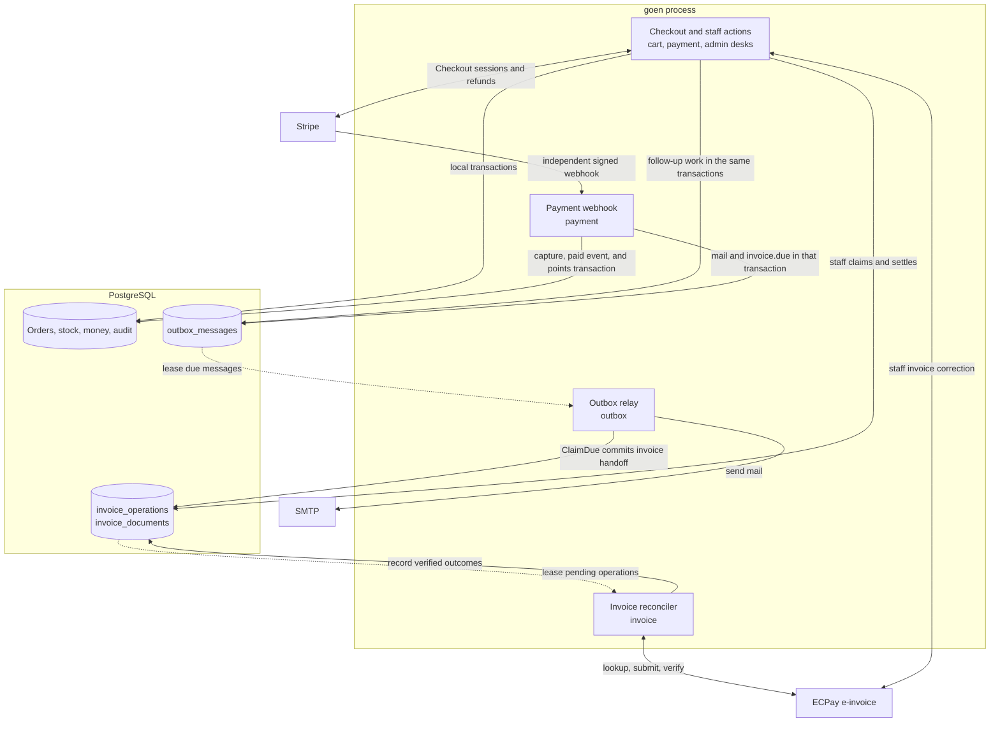
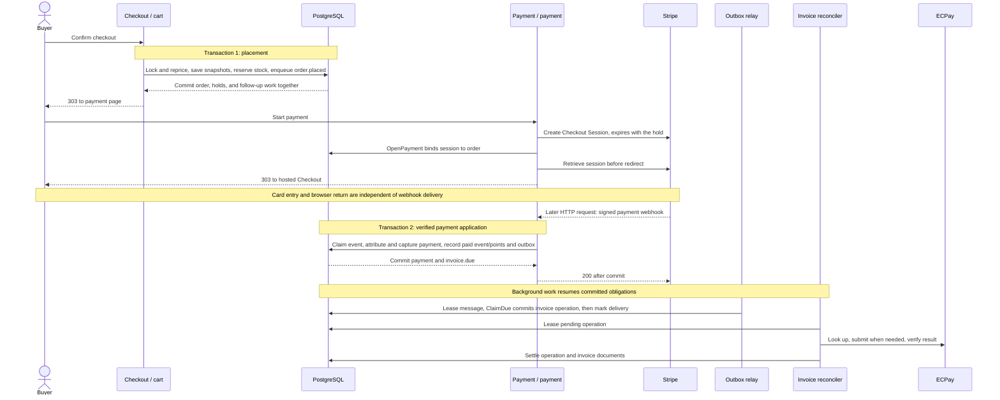
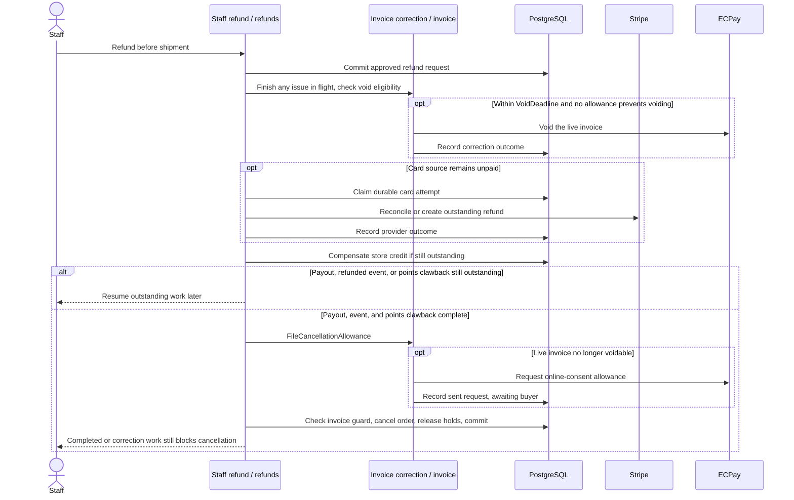
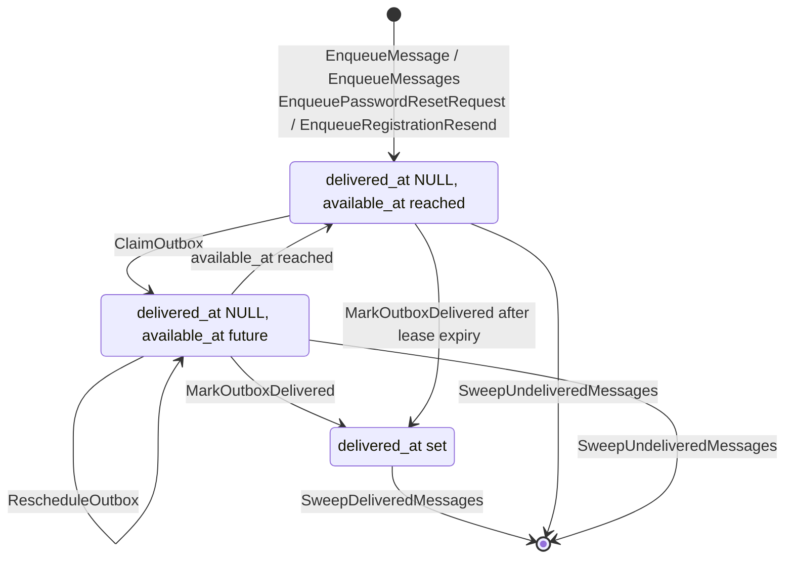
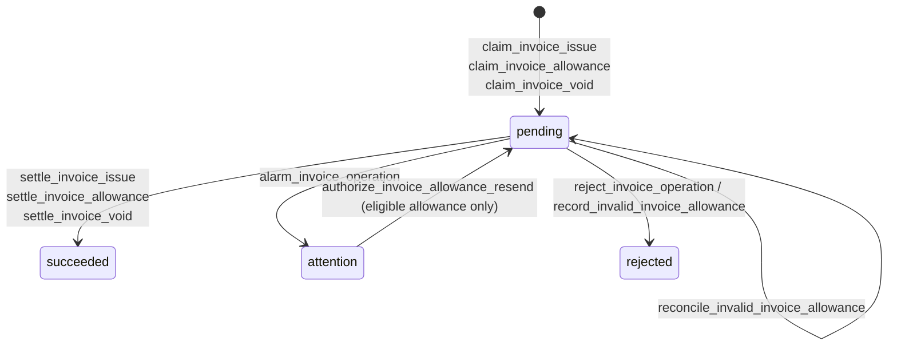
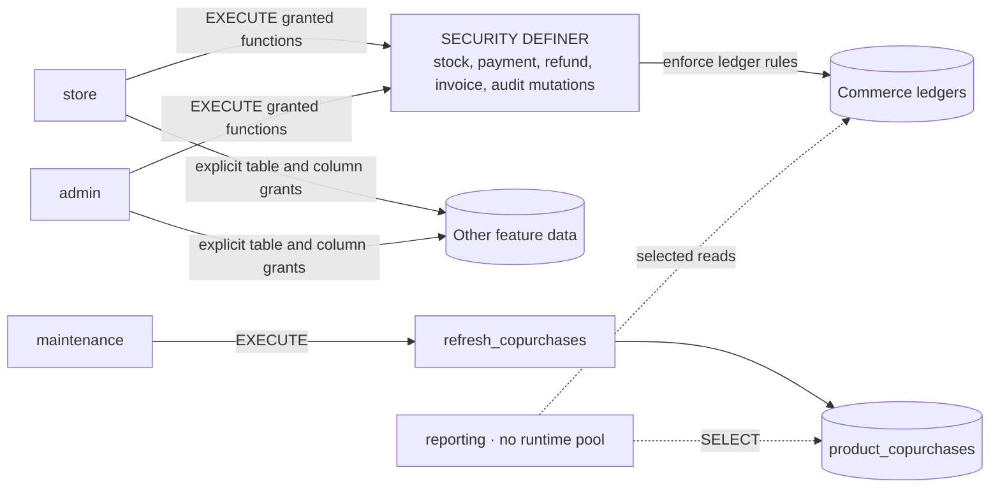
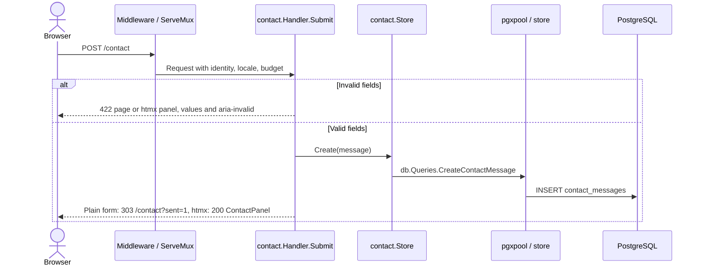

# Architecture

goen runs a Taiwan shop as one Go process and one PostgreSQL database. The process serves shopper and staff HTML, coordinates Stripe payments and ECPay invoices, and runs background workers. PostgreSQL keeps the local commerce records and enforces money, stock, and history rules; provider outcomes are verified before goen records them as settled.

An order does not have one status that answers every business question. Its purchase terms, stock reservation, payment, fulfillment, refund, and invoice have different lifetimes. The design coordinates those records through local transactions and durable follow-up work ([checkout](internal/cart/store.go), [payment settlement](internal/payment/store.go), [invoice reconciliation](internal/invoice/recovery.go)). Setup and contributor commands belong in [CONTRIBUTING.md](CONTRIBUTING.md).

## System context

The deployment unit is one binary next to PostgreSQL, configured through `GOEN_*` variables in [.env.example](.env.example). Requests and workers share that process; the rate limits and connection budgets assume one instance ([operating assumptions](CONTRIBUTING.md#what-goen-assumes)).

ECPay invoicing and the store map have separate configuration and request paths: [`invoice.Gateway`](internal/invoice/ecpay.go) handles invoices; [`cart.StoreMap`](internal/cart/ecpaymap.go) prepares the browser picker and validates its return. `payment.Gateway` creates hosted sessions and verifies webhooks in [payment/stripe.go](internal/payment/stripe.go).

## Responsibilities and sources of truth

The storefront gathers shopping intent; checkout commits the purchase terms. Staff then control picking, shipments, return assessment, and recovery actions. The following records answer different questions:

| Record | What it means and who advances it |
| --- | --- |
| Cart | Mutable intent. Checkout rereads catalogue prices and availability; adding an item holds no stock ([`checkoutCartSnapshot`, `lockCheckoutTerms`](internal/cart/store.go)). |
| Order | The purchase-time snapshot of lines, prices, shipping terms, delivery details, invoice preferences, and locale ([`placeOrder`](internal/cart/store.go)). |
| Stock reservation | A promise of units: placement deducts availability, shipment consumes the hold, and eligible cancellation/expiry releases it ([`hold_inventory`, `consume_reservation_partial`, `release_reservation`](migrations/001_initial_schema.up.sql)). |
| Payment and refund | Local attempt identities, processing states, and verified provider money outcomes; store-credit spending and reversal use their own ledger ([payment settlement](internal/payment/store.go), [refund payout](internal/admin/refunds/payout.go)). |
| Fulfillment and return | Staff actions record picking, parcels, inspection, and restock. Payment capture alone does not pick or ship goods ([order desk](internal/admin/orders/store.go), [return desk](internal/admin/returns/store.go)). |
| Invoice operation and document | An operation records what must be requested or reconciled. A settled document records the verified ECPay result. An allowance reduces a previously invoiced amount; the online allowance flow requires buyer consent ([invoice recovery](internal/invoice/recovery.go)). |

PostgreSQL is authoritative for goen's snapshots, ledgers, access grants, and local transitions. Stripe supplies payment/refund outcomes; ECPay supplies invoice outcomes. goen accepts those facts only after checking their identity and amounts against its own records. A browser returning from Checkout is navigation, and an outbox delivery acknowledging an invoice handoff does not mean the invoice has been issued ([webhook attribution](internal/payment/store.go), [`ClaimDue`](internal/invoice/store.go)).

The map below follows commerce writes. Solid arrows show request/provider work or committed writes; dotted arrows show workers picking up durable work. All application blocks run inside the same binary.

Mail and invoice obligations survive the originating request because they are stored with the business change. [`startWorkers`](cmd/goen/main.go) resumes them in-process; refund recovery is a staff action through [`Resume`](internal/admin/refunds/payout.go). Co-purchases and image renditions are derived data that can be rebuilt; order and money history are retained business records ([recommend](internal/recommend/store.go), [media rendering](internal/media/render.go)).

## Transactions and provider boundaries

Placing an order finishes one local transaction. Starting a Stripe session is a later request; applying its payment result is another transaction, triggered by a signed webhook. Issuing the invoice continues after that commit. No transaction spans PostgreSQL and either provider.

[`placeOrder`](internal/cart/store.go) claims a checkout retry key and requires the locked quote to match what the buyer confirmed. It always queues `order.placed`; it also queues `invoice.due` at placement when store credit covers a positive total. Zero-owed orders skip Stripe. Expiry preserves holds for committed, zero-owed, and unresolved-payment orders; shipment consumes holds without a second stock debit ([reservation functions](migrations/001_initial_schema.up.sql), [expiry sweep](internal/cart/sweeper.go)).

The hold lasts 60 minutes. A new Checkout Session must start within 29 minutes so Stripe's minimum lifetime fits inside it; [`StartSession`](internal/payment/stripe.go) pins card methods and `ExpiresAt` to that hold. A failure to record a newly created session triggers expiration/recovery. Stripe can replay the original create response for the same idempotency key after the session expires, so goen retrieves current provider state before redirecting ([payment flow](internal/payment/handler.go), [checkout constants](internal/cart/cart.go), [payment limits](internal/payment/payment.go)).

[`processWebhook`](internal/payment/store.go) claims the event and applies its effects atomically. `webhookTx.Capture` finds the order through goen's own payment row, checks amount/currency, calls `capture_payment`, and queues `invoice.due`; `CompleteFunding` records the paid event, rewards, and receipt. Database failure returns `500` for Stripe to retry. An identified but unappliable event can instead commit an alarm and receive `200`, leaving reconciliation to staff ([Webhook](internal/payment/handler.go)).

## Failure handling and operating limits

Recovery follows the record that already owns the unfinished work. Provider calls can outlive a request or succeed before their local result is recorded; durable identities let the next attempt reconcile rather than guess.

| Incomplete work | Who resumes it and when |
| --- | --- |
| Checkout placement | The buyer retries the same checkout key; a changed locked quote requires confirmation ([cart store](internal/cart/store.go)). |
| Payment webhook | Stripe retries a `500`; staff reconcile durable alarms when identity or funding facts cannot safely be applied ([Webhook](internal/payment/handler.go), [health reconciliation](internal/admin/health/reconcile.go)). |
| Complete Checkout Session with no applied payment and no outstanding webhook alarm | Staff confirm the Stripe outcome, then use `/admin/health` and [`ReconcileCompletePayment`](internal/admin/health/reconcile.go). Paid attribution calls `attribute_complete_payment_paid` and commits its follow-up effects and audit together; `release_complete_payment` permits a later attempt only after confirmed non-payment or a full refund. |
| Abandoned unpaid holds | [`cart.Store.SweepForever`](internal/cart/sweeper.go) releases eligible expired holds and cancels lapsed unpaid orders. Pending orders with unresolved payment outcomes retain their holds until reconciliation. |
| Mail or invoice handoff | The outbox worker retries with backoff; work appears on `/admin/health` after eight attempts and continues daily until retention expires ([outbox](internal/outbox/outbox.go)). |
| Invoice provider work | The reconciler retries due `pending` operations. `attention` stops automatic leasing; staff investigate facts or authorize an eligible allowance resend ([invoice recovery](internal/invoice/recovery.go)). |
| Refund payout | Staff `Resume` reconciles the durable card attempt and retries outstanding card/credit sources; provider acceptance alone is not settled money ([refund payout](internal/admin/refunds/payout.go)). |

[`prepareRuntimePosture`](cmd/goen/main.go) rejects missing SMTP/TOTP configuration in secure mode; [provider posture](cmd/goen/provider_posture.go) requires secure cookies and production invoicing for live Stripe. Missing provider configuration disables specific features:

- Without Stripe, [card payment](internal/payment/handler.go) is unavailable.
- Without ECPay invoicing, [invoice controls](cmd/goen/server.go), [invoice reconciliation](cmd/goen/main.go), and the [remote mobile-barcode check](internal/cart/mobilebarcode.go) are disabled.
- Without the ECPay store map, checkout offers no store pickup and the [map-return route](cmd/goen/server.go) is not registered.
- Without Google sign-in, customers use passwords and [both Google routes](internal/account/handler.go) return `404`.

`/healthz` reports liveness, `/readyz` checks store/admin connectivity, and [the health desk](internal/admin/health) exposes pools and unresolved work.

The process uses in-memory rate limits and fixed pools. Images share PostgreSQL storage and reads with commerce data ([operating assumptions](CONTRIBUTING.md#what-goen-assumes)); catalogue search uses bounded escaped `ILIKE` patterns ([catalog queries](internal/catalog/query.sql)). These choices keep the running system small and place its capacity limits on the same process and database.

## Cancellation, returns, and invoice correction

[`admin/orders`](internal/admin/orders) records parcels and shipped quantities; [`returnpage`](internal/returnpage) accepts requests against shipped goods. When approving a return, [`admin/returns.Store.Decide`](internal/admin/returns/store.go) commits the assessed refund allocation through `closeReturn`, then calls `PayApproved` in the same request. Unsettled sources remain outstanding for retry. Inspection/restock is recorded separately; completing a return posts no stock. [`refunds/payout.go`](internal/admin/refunds/payout.go) retries outstanding card/credit sources and records the refunded event only after both settle.

Refunding money, correcting its tax document, and releasing held stock are separate steps. For a staff refund before shipment, [`RefundBeforeShipment`](internal/admin/refunds/beforeshipment.go) persists the approved refund request, tries invoice correction, pays the outstanding sources, then performs guarded cancellation and stock release. An invoice error does not stop the payout; unresolved correction can still block final cancellation. Settled money can also leave a refunded event or points clawback to record.

[`CorrectForCancellation`](internal/invoice/cancellation.go) finishes an in-flight issue and voids a live uniform invoice within ECPay's `VoidDeadline` when no allowance prevents voiding. When the window has passed or an existing allowance prevents voiding, `FileCancellationAllowance` files an online-consent allowance after payout. The buyer must agree before the allowance becomes a settled document; cancellation can proceed once the allowance has been sent under the database guard. `sendAllowance` and `awaitBuyer` in [recovery.go](internal/invoice/recovery.go) preserve that distinction.

Customer cancellation of a pending order paid entirely by store credit follows [`cart.CancelOrder`](internal/cart/cancel.go): credit reversal and `invoice.EnqueueVoidDue` commit together. `ClaimVoidDue` can claim a void within its window; a non-voidable invoice remains a staff health task, rather than automatically following the staff allowance workflow.

## Durable background work

### Outbox: delivery conditions, not a status enum

[`outbox_messages`](migrations/001_initial_schema.up.sql) stores `delivered_at`, `available_at`, and `attempts`. A future availability time means either a delivery lease or retry backoff. Enqueue queries live in [cart/query.sql](internal/cart/query.sql) and [account/query.sql](internal/account/query.sql); delivery and retention queries live in [outbox/query.sql](internal/outbox/query.sql).

[`Store.Drain`](internal/outbox/outbox.go) calls `ClaimOutbox` to acquire rows with `SKIP LOCKED` and a durable lease. `deliver` runs the bounded handler and records success; `reschedule` applies backoff. After eight attempts, undelivered messages appear on [`/admin/health`](internal/admin/health/health.go) and retry daily; delivered and undelivered retention are each 30 days with different starting timestamps. `(topic, dedupe_key)` suppresses duplicates while its row exists. A crash after an external send but before stamping delivery can repeat the send: this is at-least-once delivery with bounded retention.

### Invoice operations: durable provider reconciliation

Completing an invoice outbox message transfers responsibility to the invoice reconciler. For an invoice still owed, the `invoice.due` handler claims an `invoice_operations` row; satisfied or cancelled obligations can complete without a new claim. Outbox handoff and provider settlement are separate outcomes. [`ClaimDue`](internal/invoice/store.go) freezes the request before network work. Staff invoice actions can also claim operations directly.

[`ReconcileOnce`](internal/invoice/recovery.go) leases due `pending` operations. `processIssue` looks up provider truth before submission and verifies identity, amount, and itemization before settlement. Outages remain pending with backoff; mismatched facts enter `attention`, which automatic leasing excludes. `succeeded` and `rejected` preserve the completed operation's evidence.

[`reconcile_invalid_invoice_allowance`](migrations/001_initial_schema.up.sql) refreezes a leased, unsent allowance after verifying invalidation of its prior document, using the currently settled refunds. Allowance consent is asynchronous: an empty lookup after sending does not permit another send. `awaitBuyer` waits through the consent window; `authorize_invoice_allowance_resend` is a narrowly checked staff action, not a general `attention` retry. Cancellation handoff may find no further operation due ([invoice/cancellation.go](internal/invoice/cancellation.go), [recovery.go](internal/invoice/recovery.go)).

## Database authority and invariants

[Schema grants](migrations/001_initial_schema.up.sql) reserve ledger mutations for granted `SECURITY DEFINER` functions. Tables that neither `store` nor `admin` may directly insert, update, or delete include `payments`, `refunds`, `invoice_operations`, `invoice_documents`, `invoice_document_lines`, `audit_events`, `inventory_movements`, `inventory_reservations`, `store_credit_entries`, `order_number_counters`, and `loyalty_redemption_operations`.

[`TestEveryDefinerWrittenTableIsRevoked`](internal/db/coverage_integration_test.go) checks table-level privileges for every statically detected definer-written table, including explicit exceptions for first-use `store_credit_accounts` insertion and shared cleanup. Catalogue-column grants permit product edits while protecting stock quantities. The storefront also inserts webhook evidence into `payment_webhook_events` and checkout preferences into `invoice_preferences`.

`reporting` excludes sensitive account/delivery data and outbox/invoice-operation payloads. The schema owner applies migrations. [`audit.Run` / `audit.In`](internal/admin/audit/audit.go), or the privileged function owning an operation, commit staff changes with their audit evidence. `audit_events_append_only` preserves the trail while allowing actor clearing during account erasure.

The [schema](migrations/001_initial_schema.up.sql) enforces `orders_fulfillment_status_known`, `orders_legal_transition`, `product_variants_stock_non_negative`, `store_credit_never_negative`, and `refunds_within_capture`. Foreign keys and unique indexes preserve identities and retry deduplication. [`order.FulfillmentStatus.Next`](internal/order/order.go) mirrors legal fulfillment edges; `TestNextIsTheTransitionsTheTriggerAllows` in [transition tests](internal/admin/orders/transition_integration_test.go) checks agreement.

[`cart.Store.placeOrder`](internal/cart/store.go) snapshots lines, prices, shipping terms, addresses, and invoice preferences. `committed_orders` includes non-cancelled orders past pending or with a successful payment; `settled_orders` also includes cancelled orders. These are views; the triggers `orders_money_frozen_once_committed` and `order_lines_frozen_once_committed` enforce the totals/lines freeze through `order_is_settled`. Fulfillment, payments, refunds, and invoice operations therefore retain separate statuses.

Feature `query.sql` files are the authored query source; [`sqlc.yaml`](sqlc.yaml) lists them. Migration `001` is amended in place only before real shop data exists; the first production deployment freezes it and subsequent changes use numbered migrations ([migration policy](CONTRIBUTING.md#what-goen-assumes)).

Normalized uploaded images live in `media_objects`; [`media.renderer`](internal/media/render.go) keeps width renditions in a bounded process cache. Image keys can also name embedded assets, so catalogue image references are not foreign keys to `media_objects`.

## Security boundaries

Staff authenticate as accounts: [`HashPassword` / `VerifyPassword`](internal/account/account.go) use Argon2id. [`access.Control.RequireStaff`](internal/admin/access/access.go) requires staff identity and configured TOTP step-up, returning `404` to signed-out visitors and ordinary customers; administrator-only operations add `RequireAdmin`. [`twofactor.Verify`](internal/twofactor/totp.go) rejects replayed steps; [encrypted secrets](internal/twofactor/crypt.go) use AES-256-GCM.

[`account`](internal/account/account.go) uses opaque session tokens, persisted as hashes by [account/store.go](internal/account/store.go), and `__Host-` secure, HttpOnly cookies in secure mode. [`crossOriginProtection`](cmd/goen/middleware.go) uses Go's origin defence with a precise configured store-map return bypass; Stripe authentication comes from webhook signatures. [`securityHeaders`](cmd/goen/middleware.go) and [`policyWith`](cmd/goen/server.go) set CSP and narrow form destinations.

[`ratelimit`](internal/ratelimit) limits sensitive routes in memory; `Proxies.Resolve` trusts forwarded client addresses only from configured proxies. Database roles limit SQL authority independently of the signed-in user's role. Ownership checks still belong to handlers/stores; possessing the `store` connection does not establish ownership of an order.

## Language, money, and time

[`i18n`](internal/i18n) declares application wording in both languages; locale detection gives explicit preference priority over `Accept-Language`. Shop copy uses authored translations. Orders save their locale for later mail ([cart/store.go](internal/cart/store.go)); `TestNoChromeStringIsHardCoded` guards application-text ownership ([hardcoded_test.go](internal/i18n/hardcoded_test.go)).

Amounts are integer cents bounded by the schema; [`money`](internal/money/money.go) centralises parsing and TWD formatting. [`shoptime`](internal/shoptime/shoptime.go) uses `Asia/Taipei` with embedded zone data; SQL `shop_day` uses the same calendar. Host timezone therefore does not choose the date shown on an order or interpreted from an ECPay timestamp.

## Technology choices

Runtime libraries and the templ tool are pinned in [go.mod](go.mod); sqlc, migrate, and axe-core are pinned in [Makefile](Makefile).

| Choice | Role in goen | Why |
| --- | --- | --- |
| Go `net/http` | Routing, middleware, request contexts, HTTP lifecycle | One mux composes feature handlers; built-in [`CrossOriginProtection`](cmd/goen/middleware.go) protects browser writes without per-form CSRF tokens. |
| `github.com/a-h/templ` | Typed page/component rendering | [Templates](internal/ui/pages) compile with their Go view types; [`templ-check`](Makefile) catches source/output drift. |
| htmx | HTML fragment enhancement | [`ContactPanel`](internal/ui/pages/contact.templ) retains a plain form action/method while adding fragment replacement; the server owns the operation in both modes. |
| `github.com/jackc/pgx/v5` | PostgreSQL connections, pools, transactions | Separate fixed-role pools prevent `SET ROLE` on a reused connection from running the next storefront request as admin ([`openAdminPool`](cmd/goen/main.go)). |
| sqlc | SQL-to-Go query generation | [sqlc.yaml](sqlc.yaml) compiles feature-owned SQL into typed `db.Queries`, keeping the executed SQL reviewable beside its feature. |
| `github.com/golang-migrate/migrate/v4` | Numbered SQL migration execution | Applies the plain SQL migration files as the schema owner, outside binary startup ([migration commands](Makefile)). |
| PostgreSQL roles + `SECURITY DEFINER` | Restricted business mutations | [Schema grants and functions](migrations/001_initial_schema.up.sql) make payment, refund, invoice, and ledger rules apply across all callers. |
| `github.com/stripe/stripe-go/v86` / Checkout | Hosted card entry, payment events, refunds | Stripe hosts card entry; [`StartSession`](internal/payment/stripe.go) binds the remote session to local stock expiry, and local payment rows anchor attribution. |
| ECPay clients in `invoice` and `cart` | E-invoices, mobile barcodes, store selection | The shop files Taiwan uniform invoices ([shop scope](CONTRIBUTING.md#what-goen-is)); the [store map](internal/cart/ecpaymap.go) supplies convenience-store selection under its logistics contract. |
| `golang.org/x/crypto/argon2` | Customer and staff password hashing | Salted Argon2id makes password guessing memory- and work-intensive; [`HashPassword`](internal/account/account.go) fixes those costs for customer and staff credentials. |
| Go HMAC-SHA1 / AES-GCM; `rsc.io/qr` | Staff TOTP, encrypted secrets, enrollment QR | Authenticator-compatible codes add staff step-up; [`twofactor`](internal/twofactor) rejects replay, encrypts stored secrets, and renders `ProvisioningURI` as a QR code. |
| Go `log/slog` | Request, worker, and query diagnostics | Request identity connects HTTP and query diagnostics; [`slowQueryTracer`](cmd/goen/slowquery.go) omits SQL arguments, which carry customers' personal data. |
| `testcontainers-go` + `modules/postgres` | PostgreSQL integration fixtures | [`dbtest.Start`](internal/db/dbtest/dbtest.go) applies real migrations so constraints, role grants, and concurrent writes are exercised by PostgreSQL itself. |
| Chrome/Chromium + axe-core | Browser layout/accessibility gate | [Browser probes](scripts/check-layout.mjs) test rendered dimensions, keyboard behaviour, and accessibility that template structure alone cannot establish. |

[`assets`](assets/assets.go) embeds CSS, fonts, htmx, and the application script with content-versioned URLs. CSS is authored in `base.css`, `app.css` (storefront) and `admin.css` (back office); the browser enhancement is [goen.js](assets/js/goen.js). [CONTRIBUTING.md](CONTRIBUTING.md) establishes plain forms and authored CSS as project boundaries.

## Testing and CI

[verify.yml](.github/workflows/verify.yml) defines these jobs; [Makefile](Makefile) owns their commands.

| Job / test layer | What it checks |
| --- | --- |
| `ci-policy` | Workflow syntax and fail-closed gate contracts through `workflow-check`. |
| `commit-attribution` | Commit metadata against the repository attribution policy. |
| `verify` | Formatting, templ/sqlc drift, migration lint, vet, dead code, lint, production build, `go vet -tags=integration`, shuffled race-enabled unit/handler tests. |
| `schema` | Real PostgreSQL integration via [dbtest](internal/db/dbtest), schema conformance, concurrent-write behaviour, migration up/down/up. |
| `layout` | Chrome route probes at 375/1440 px; extra homepage/listing checks at 768/1024 and targeted interaction widths; axe-core (WCAG 2.2 level AA) at 1440 px, failing on new serious or critical WCAG violations against the accepted baseline ([probes](scripts/check-layout.mjs)). |
| `vulnerabilities` | Reachable Go dependency vulnerabilities through `govulncheck`. |
| CodeQL `analyze` | Go and Actions analysis in [codeql.yml](.github/workflows/codeql.yml). |

`TestEveryCheckConstraintIsExercised` and `TestEveryDefinerWrittenTableIsRevoked` derive database obligations from the catalogue ([coverage tests](internal/db/coverage_integration_test.go)). `TestTwoOrdersCannotTakeTheSameLastUnit` and `TestRefundsCannotRacePastCapture` exercise concurrency ([cart tests](internal/cart/integration_test.go), [rule tests](internal/db/rules_integration_test.go)). `TestEveryFormWorksWithScriptingOff` checks form structure ([writeface_test.go](internal/ui/pages/writeface_test.go)); the browser gate tests rendered pages and interactions.

## Implementation reference

### Startup and pools

[`run`](cmd/goen/main.go) calls `loadConfig`, validates runtime/provider posture, creates mail and provider clients, opens and pings the pools, builds the router, starts workers, and serves HTTP. SIGINT/SIGTERM cancels the shared context; HTTP gets a bounded drain and workers finish before pools close. Migrations run through explicit tooling, outside binary startup.

[`servingPool`](cmd/goen/main.go) wraps `openPool`, and `reachableAdminPool` wraps `openAdminPool`, adding startup reachability checks.

| Pool constructor / role | Maximum connections | SQL statement budget | Users |
| --- | --- | --- | --- |
| `openPool` / `store` | 25 | 15 seconds | Storefront, account authentication, outbox, customer-data sweeps. |
| `openAdminPool` / `admin` | 10 | 30 seconds | Back-office stores, invoice operations, media cleanup. |
| `openMaintenancePool` / `maintenance` | 2 | 5 minutes | Co-purchase refresh. |

Each pool assigns its role when connecting. [`StorefrontConfig` and `BackOfficeConfig`](cmd/goen/server.go) feed `newRouter`, which calls `storefrontRoutes` and `backOfficeRoutes`. Back-office business handlers use `admin`; their shared session authentication still reads through `store`. `reporting` is a schema role with no runtime pool.

### Incoming middleware order

[`newServer`](cmd/goen/main.go), [`newRouter`](cmd/goen/server.go), and [`withRequestTracing`](cmd/goen/middleware.go) establish this order, outermost first:

1. `ratelimit.Proxies.Resolve` derives the client address through configured trusted proxies.
2. `withRequestID` validates or generates the request identifier and echoes it.
3. `requestLog` records the method, path, final status, and duration.
4. `recoverPanic` logs panics and sends a failure response if headers remain unwritten.
5. `web.Compress` compresses eligible dynamic responses.
6. `securityHeaders` applies CSP, nosniff, referrer policy, and secure-mode HSTS.
7. `web.RefuseUnstorableText` rejects invalid UTF-8 and NUL in paths and queries.
8. `crossOriginProtection` rejects cross-site writes, with a configured store-map return exception.
9. `withRequestBudget` bounds request work, including `/admin`, except static assets, media, probes, webhooks, and the favicon.
10. `onlyVisitorPaths(customers.Authenticate)` loads the session identity.
11. `onlyVisitorPaths(basket.WithCount)` populates the cart count.
12. `onlyVisitorPaths(withLocale)` chooses the language and locale-switch return path.
13. `withNoStore` prevents caching signed-in, private/token, and write responses.
14. `withSiteOrigin` supplies the canonical origin/path for document URLs.
15. `withStaffEntrance` tells storefront pages a signed-in staff member may reach the back office.
16. `withTopNav` loads localized storefront categories.
17. `withBanner` loads the eligible promotional banner.
18. `http.ServeMux` dispatches through route-specific access/rate-limit guards to the feature handler.

`onlyVisitorPaths` skips static assets, media, probes, webhooks, and the favicon. Navigation/banner middleware has its own applicability checks.

### Every background loop

[`startWorkers`](cmd/goen/main.go) starts nine unconditional loops and, when the invoice gateway is enabled, an invoice reconciliation loop. Every loop runs under the process context.

| Loop | Pool | Work |
| --- | --- | --- |
| [`outbox.Store.Run`](internal/outbox/outbox.go) | `store`; invoice handoff uses `admin` | Deliver mail/account/newsletter topics and hand off invoice obligations. |
| [`outbox.Store.SweepForever`](internal/outbox/outbox.go) | `store` | Remove delivered and undelivered messages past retention. |
| [`cart.Store.SweepForever`](internal/cart/sweeper.go) | `store` | Release eligible expired reservations and cancel lapsed unpaid orders. |
| [`cart.Store.SweepAttemptsForever`](internal/cart/sweeper.go) | `store` | Remove old checkout attempts. |
| [`orderaccess.Store.SweepForever`](internal/orderaccess/orderaccess.go) | `store` | Remove order-access grants nobody can present any more. |
| [`cart.Store.SweepDraftsForever`](internal/cart/sweeper.go) | `store` | Clear stale checkout drafts from carts. |
| [`account.Store.SweepSessionsForever`](internal/account/store.go) | `store` | Remove expired sessions and old reset tokens. |
| [`media.Store.SweepForever`](internal/media/sweeper.go) | `admin` | Remove unreferenced uploads after their grace period. |
| [`invoice.Store.ReconcileForever`](internal/invoice/recovery.go) | `admin` | Reconcile invoice operations when the gateway is enabled. |
| [`recommend.Store.RefreshForever`](internal/recommend/store.go) | `maintenance` | Rebuild co-purchase data under an advisory lock. |

### One form request: `POST /contact`

[`contact.Handler.Submit`](internal/contact/handler.go) validates before persistence; `respond` chooses a full page or `ContactPanel` using `web.IsHTMX`.

[`contact.Store.Create`](internal/contact/store.go) calls [CreateContactMessage](internal/contact/query.sql). [`ContactPanel`](internal/ui/pages/contact.templ) preserves submitted fields; [`components.Input` / `Textarea`](internal/ui/components/components.templ) emit `aria-invalid` from `FieldProps.Invalid`. This route returns `429` for rate limiting and `500` with retained values for storage failure.

### Code organisation and imports

[CONTRIBUTING.md](CONTRIBUTING.md#change-it) establishes feature packaging: handlers, stores, SQL, and tests live together. Handlers call stores; stores use `db.Queries` and may return `ui/pages` view models directly. `cmd/goen` wires the dependencies. [`sqlc.yaml`](sqlc.yaml) maps each feature's `query.sql` into `internal/db`; [`make gen`](Makefile) turns UI and email `.templ` sources into `*_templ.go`.

Features share selected operations and view types. [`cart`](internal/cart) imports `account`, `payment`, and `invoice`; [`admin/orders`](internal/admin/orders) imports `catalog`, `payment`, and `invoice`. Outbox, email, and media are used across storefront and back-office packages. Both page packages use [invoice types](internal/ui/pages/cart.go) and `returns` vocabulary ([shopper views](internal/ui/pages/returns.go), [staff views](internal/ui/pages/admin/returns.go)). [`order.Delivery`](internal/order/delivery.go) centralises delivery validation and itself depends on `destination`, `email`, `i18n`, `pickup`, and `web`. [#1020](../../issues/1020) governs conventions and staged moves; this is the current arrangement.

| Package | Responsibility |
| --- | --- |
| [`cmd/goen`](cmd/goen) | Configuration, composition, routes, middleware, workers, process lifecycle. |
| [`assets`](assets) | Embedded assets, versioned URLs, asset compression, media URL selection. |
| [`internal/account`](internal/account) | Identity, passwords, sessions, profiles, addresses, Google sign-in, customer pages. |
| [`internal/admin`](internal/admin) | Cross-desk integration and pagination tests. |
| [`internal/admin/access`](internal/admin/access) | Staff/admin guards, TOTP step-up, refusal pages. |
| [`internal/admin/access/accesstest`](internal/admin/access/accesstest) | Shared tests that desk routes refuse outsiders. |
| [`internal/admin/admintest`](internal/admin/admintest) | Shared back-office integration fixtures and helpers. |
| [`internal/admin/audit`](internal/admin/audit) | Audited transactions, action vocabulary, audit-history pages. |
| [`internal/admin/campaigns`](internal/admin/campaigns) | Sale campaigns and their merchandise. |
| [`internal/admin/content`](internal/admin/content) | Hero, banner, FAQ, and newsletter authoring. |
| [`internal/admin/coupons`](internal/admin/coupons) | Coupon creation and administration. |
| [`internal/admin/customers`](internal/admin/customers) | Customer lookup, account/order information, read-only warranty search. |
| [`internal/admin/feedback`](internal/admin/feedback) | Reviews, questions, and contact-message handling. |
| [`internal/admin/health`](internal/admin/health) | Pool health, unresolved work, reconciliation controls. |
| [`internal/admin/invoicing`](internal/admin/invoicing) | Staff invoice issue, void, and correction actions. |
| [`internal/admin/loyalty`](internal/admin/loyalty) | Membership tiers and store-credit administration. |
| [`internal/admin/orders`](internal/admin/orders) | Dashboard, order desk, shipments, fulfillment, timelines. |
| [`internal/admin/products`](internal/admin/products) | Products, variants, and product images. |
| [`internal/admin/refunds`](internal/admin/refunds) | Card/credit payouts and before-shipment cancellations. |
| [`internal/admin/refundstate`](internal/admin/refundstate) | Shared refund statuses and refused/incomplete outcomes. |
| [`internal/admin/reports`](internal/admin/reports) | Sales reports over selected periods. |
| [`internal/admin/returns`](internal/admin/returns) | Return assessment, inspection, decisions, refund initiation. |
| [`internal/admin/shipping`](internal/admin/shipping) | Shipping methods, destinations, zones, surcharges. |
| [`internal/admin/staff`](internal/admin/staff) | Staff roster, permissions, invitations, lost-factor removal. |
| [`internal/admin/stock`](internal/admin/stock) | Stock adjustments, low-stock views, movement history. |
| [`internal/admin/taxonomy`](internal/admin/taxonomy) | Brands, categories, and category images. |
| [`internal/carrier`](internal/carrier) | Parcel-carrier identities and delivery compatibility through `ForDelivery`. |
| [`internal/cart`](internal/cart) | Baskets, checkout, holds, order page/cancellation/reorder, pickup flow. |
| [`internal/catalog`](internal/catalog) | Listings, search, comparisons, deals, campaign browsing. |
| [`internal/contact`](internal/contact) | Contact-form validation and stored messages. |
| [`internal/coupon`](internal/coupon) | Closed coupon kinds shared by checkout, administration, and presentation. |
| [`internal/db`](internal/db) | Generated queries/types, schema-conformance and CI-policy tests (`workflow-check`). |
| [`internal/db/dbtest`](internal/db/dbtest) | PostgreSQL testcontainers and migration fixtures. |
| [`internal/destination`](internal/destination) | Closed shipping-destination vocabulary. |
| [`internal/email`](internal/email) | Mail content, templ rendering, SMTP/log transports. |
| [`internal/fieldrule`](internal/fieldrule) | Browser field constraints aligned with server validation. |
| [`internal/home`](internal/home) | Homepage and shared navigation/banner reads. |
| [`internal/i18n`](internal/i18n) | Application wording, locale detection, translated labels. |
| [`internal/inventory`](internal/inventory) | The closed set of reasons a variant's stock moves. |
| [`internal/invoice`](internal/invoice) | ECPay clients, durable invoice operations, recovery, documents. |
| [`internal/layoutcheck`](internal/layoutcheck) | Tests protecting browser-gate configuration. |
| [`internal/loyalty`](internal/loyalty) | Customer points balance and redemption. |
| [`internal/media`](internal/media) | Upload validation/storage, renditions, serving, orphan cleanup. |
| [`internal/money`](internal/money) | Currency parsing, bounds, formatting. |
| [`internal/newsletter`](internal/newsletter) | Subscription confirmation/unsubscription and delivery data. |
| [`internal/order`](internal/order) | Fulfillment states, order events, order-number vocabulary, the validated delivery recipient and destination. |
| [`internal/orderaccess`](internal/orderaccess) | Who may open a placed order's pages: a browser granted it, or the signed-in owner. |
| [`internal/ordernotice`](internal/ordernotice) | Terminal-order mail with recipients resolved at delivery. |
| [`internal/outbox`](internal/outbox) | Durable enqueueing, leasing, retry, delivery, retention. |
| [`internal/payment`](internal/payment) | Stripe attempts, Checkout, signed webhook settlement. |
| [`internal/pgerr`](internal/pgerr) | PostgreSQL error classification by code/constraint. |
| [`internal/pgtx`](internal/pgtx) | The deferred rollback every store takes: detached from the request, bounded in time. |
| [`internal/pickup`](internal/pickup) | Convenience-store chain identities. |
| [`internal/probe`](internal/probe) | Public liveness and database-readiness probes. |
| [`internal/product`](internal/product) | Product detail, reviews, questions, restock subscriptions. |
| [`internal/ratelimit`](internal/ratelimit) | In-memory limits and trusted-proxy client addresses. |
| [`internal/recommend`](internal/recommend) | Co-purchase projection refresh. |
| [`internal/returnpage`](internal/returnpage) | The buyer's return form for an order. |
| [`internal/returns`](internal/returns) | Return statuses and the eligibility and decision rules. |
| [`internal/shoptime`](internal/shoptime) | Shop-zone dates, times, calendar calculations. |
| [`internal/site`](internal/site) | Information/policies, sitemap, locale switching, 404 pages. |
| [`internal/twofactor`](internal/twofactor) | TOTP enrollment, encrypted secrets, verification, session step-up. |
| [`internal/ui/chart`](internal/ui/chart) | Server-rendered SVG charts; draws only, its text equivalent is the page's row or table. |
| [`internal/ui/components`](internal/ui/components) | Reusable controls and presentation components. |
| [`internal/ui/icons`](internal/ui/icons) | SVG icons and category-icon selection. |
| [`internal/ui/layouts`](internal/ui/layouts) | Shared document head, page chrome, layout context. |
| [`internal/ui/pages`](internal/ui/pages) | Storefront/account templates and view models. |
| [`internal/ui/pages/admin`](internal/ui/pages/admin) | Back-office templates and view models. |
| [`internal/user`](internal/user) | The signed-in user, `users.role`, and the context that carries them. |
| [`internal/warranty`](internal/warranty) | Warranty registration for purchased units. |
| [`internal/web`](internal/web) | Rendering, forms, pagination, compression, text/HTTP helpers. |
