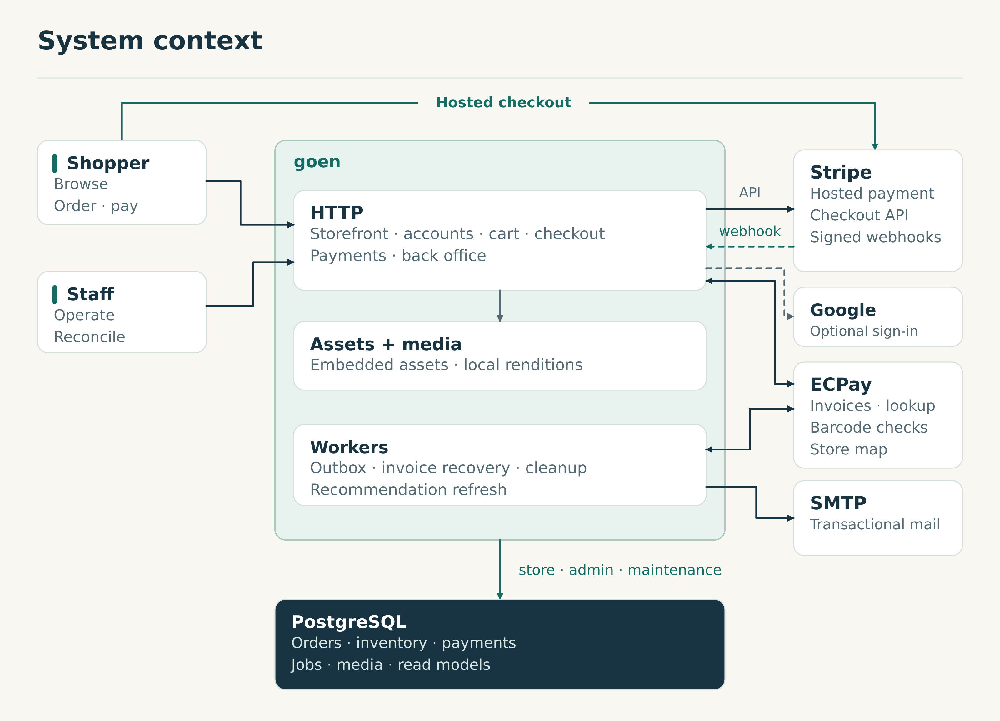
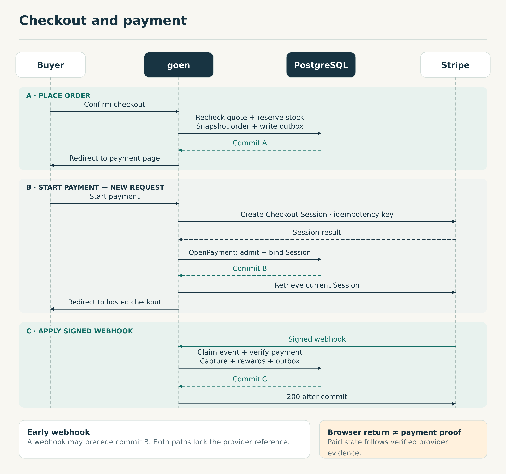
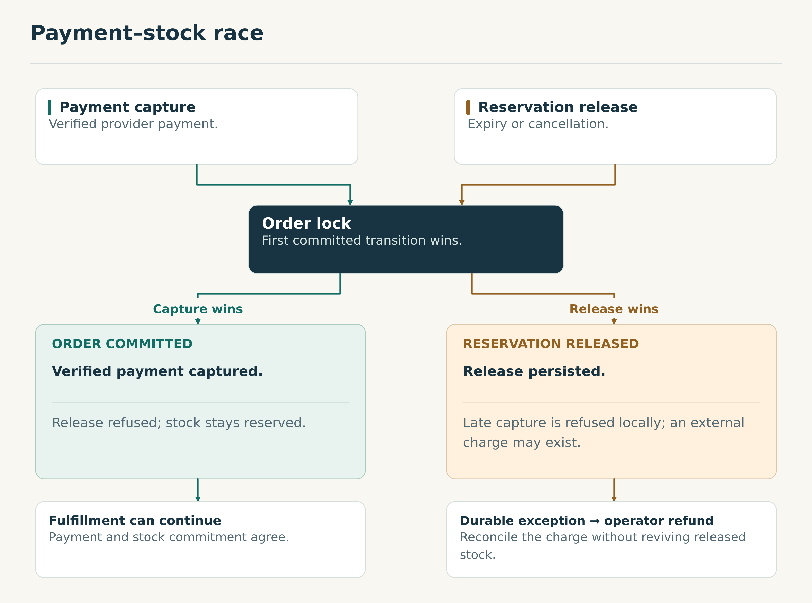
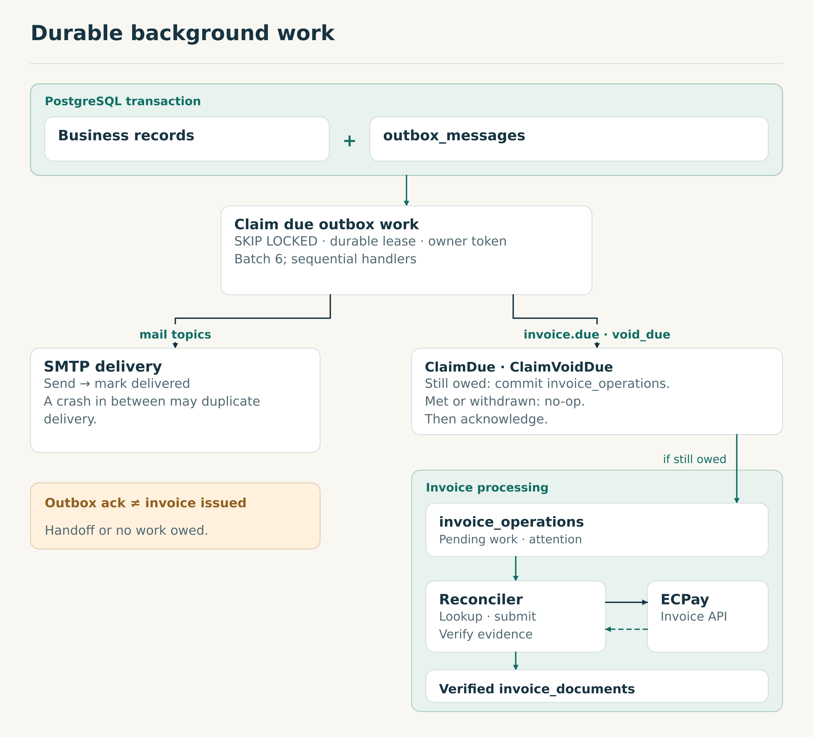
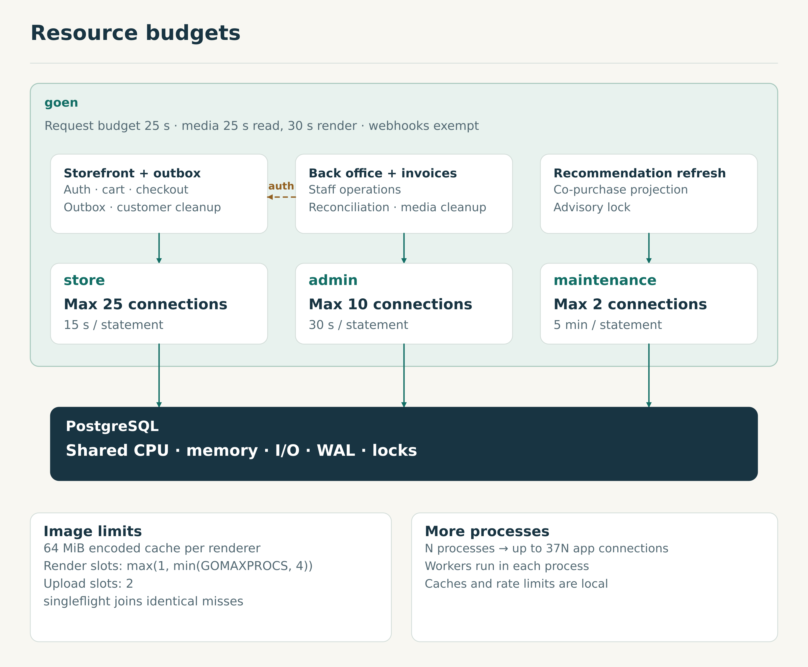

# Architecture

[繁體中文](ARCHITECTURE.zh-TW.md)

goen is a full-stack e-commerce application in Go. The storefront, back office, and background workers share one process and keep orders, inventory, and ledgers in PostgreSQL. Stripe handles payments and refunds; ECPay handles electronic invoices.

## 1. Commerce model

Shopping intent, stock, money, fulfillment, and invoicing have separate lifetimes, so goen records them separately. An order can be paid but unshipped, or refunded with its invoice correction still outstanding.

| Record | Responsibility |
| --- | --- |
| Cart | Mutable intent. Adding an item reserves no stock; checkout revalidates current terms. |
| Order and lines | What the buyer confirmed: items, prices, warranty terms, shipping, delivery, invoice preferences, and locale. |
| Inventory reservation | Units held for an order. Placement reduces availability, shipment consumes the hold, and eligible cancellation or expiry releases it. |
| Payment and refund | Durable attempt identities and verified money outcomes. Store credit and points keep their own ledgers. |
| Fulfillment and return | Picking, parcels, assessment, inspection, and restock, independent of money. |
| Invoice operation | Provider work awaiting submission, reconciliation, or staff attention. |
| Invoice document | A verified issue, void, or allowance. |
| Projections and renditions | Co-purchases and resized images, rebuildable from authoritative records. |

Placement copies the terms of sale, so later price changes leave history intact. Database guards freeze protected order fields once the order is in `settled_orders` (committed or cancelled), a wider set than paid orders; separately, `order_is_committed` decides that a hold may be consumed but no longer released. See [checkout][checkout] and the [schema][schema] (`settled_orders`, `order_is_committed`).

## 2. System context



### Application and presentation

`net/http` handlers render typed `templ` views. Every write works as a plain `POST` form without JavaScript: success redirects, and a failed validation keeps the input. htmx enhances the returned HTML. CSS, fonts, and scripts are embedded in the binary under content-versioned URLs.

Packages follow features: each groups its handlers, store, SQL, and tests. Stores call sqlc-generated `db.Queries`; `cmd/goen` composes routes, data access, provider clients, and workers. See [composition][server], [assets][assets], and [sqlc configuration][sqlc].

### External systems

| Integration | Responsibility |
| --- | --- |
| Stripe Checkout | Hosted card entry, sessions, signed payment events, and refunds. |
| ECPay e-invoice | Invoice issue, lookup, void, allowance, and mobile-barcode checks. |
| ECPay store map | Convenience-store selection, configured separately from invoicing. |
| SMTP | Mail delivered from durable queued work. |
| Google sign-in | Optional, alongside password sign-in. |

Unconfigured Stripe, invoicing, store map, or Google sign-in turns that feature off. Without SMTP, development mode logs mail and marks it delivered; secure mode refuses to start without SMTP, TOTP, or `GOEN_BASE_URL`. A live Stripe key also requires secure cookies, production invoicing and store-map endpoints, a real sender address, and no demo account. See [provider posture][provider-posture].

PostgreSQL also holds sessions, access grants, audit history, and uploaded images. One store keeps transactions local and backups whole, at the cost of concentrating I/O and availability on one database. Database-backed sessions let several instances serve the same login.

## 3. Checkout and payment

Placement, session binding, and webhook application commit separately. No database transaction spans a Stripe call.



### A. Place the order

`placeOrder` locks the checkout retry key, then the user and cart, then variants and products, each in UUID order. It rereads prices, shipping, stock, store credit, and coupon eligibility, and the recomputed quote must match the one the buyer confirmed.

One transaction writes the order snapshot, stock holds, ledger entries, events, and outbox rows, then clears the cart. Retrying the same key returns the original order, which covers a commit whose response was lost. An order with nothing left to pay skips Stripe; one with a positive total paid wholly by store credit spends the credit and queues `invoice.due` in the same transaction. See [placement][checkout] and the [schema][schema] (`lock_cart_catalogue`).

### B. Bind the Stripe session

A later request creates a Checkout Session under an idempotency key built from the order number, the amount owed, and the attempt. `OpenPayment` binds it to the order. goen retrieves the session again before redirecting, because Stripe may replay an earlier create response for a session that has since expired.

Stock is held for 60 minutes and a new session must start within 29, so Stripe's minimum session lifetime ends inside the hold. If binding fails after Stripe created the session, goen expires it. See [payment handling][payment-handler] and the [Stripe adapter][stripe].

### C. Apply verified payment facts

The webhook verifies the signature on the raw body, then in one transaction claims the event, finds the order through goen's payment row, checks amount and currency, and applies capture, rewards, notices, and `invoice.due`. A webhook can arrive before binding; both paths lock the same provider reference. The browser return only navigates the customer.

A database failure rolls back the claim and its effects and answers `500`, so Stripe retries. A verified event that cannot be applied safely commits an alarm and answers `200`, leaving staff a durable exception. See [webhook application][payment-store].

### Recovering a complete session

A complete session can leave a payment in `requires_reconciliation` with no webhook alarm for that reference. Staff check Stripe and use `ReconcileCompletePayment`:

- **Paid:** a guarded capture applies the funding effects and audit together. If the stock was already released, the order needs a refund.
- **Unpaid or fully refunded:** the attempt is released so the buyer can pay again.

Checkout keys, provider request keys, and event IDs each protect their own operation. After a timeout, recover under the original identity: the provider may have succeeded. See [staff recovery][health-reconcile] and [Stripe error handling][stripe-errors].

## 4. Inventory and payment races



A hold reduces sellable stock; shipment consumes it without debiting stock twice, and a partial shipment keeps holding the rest. Eligible expiry or cancellation releases it; an unresolved payment keeps it until reconciliation.

Capture and release lock the order. If capture commits first, the hold stays. If release commits first, the capture guard refuses the late payment and goen records an exception for reconciliation and refund. See the [schema][schema] (capture and release guards) and [expiry][cart-sweeper].

Held, abandoned, and slowly released stock all reduce what can be sold. How long to hold is a commercial decision as much as an operational one.

### Contention

Checkout can contend on a variant, its product, a coupon, a credit account, or the order and payment rows. Different variants of one product share the product lock, so every path must take locks in the same order.

Placement also updates the shop day's `order_number_counters` row and holds it until commit, so unrelated purchases meet there. The six-digit counter caps one shop day at 999,999 orders; the next placement that day is refused. Measure lock hold and wait times before changing critical sections or numbering. See the [schema][schema] (`next_order_number`).

## 5. Fulfillment, returns, and refunds

Staff record parcels and shipped quantities. Approving a return fixes the refund allocation, writes the audit record, and starts the payout; inspection and restock are later steps. Completing a return does not add stock.

A card refund stores its attempt identity and actor before calling Stripe, and settles only on a verified outcome; credit is refunded through the local ledger. Staff `Resume` pays whatever source is still outstanding and, once the money has settled, records any missing refunded event and points clawback. See [returns][returns] and [payout recovery][refund-payout].

A before-shipment staff refund stores the approval, attempts invoice correction, pays outstanding sources, and then cancels the order and releases stock under guards. A failed correction does not stop the payout, but can hold back the cancellation; pressing the action again resumes from the first unfinished step. Eligible invoices are voided; otherwise an allowance may need the buyer's online consent, and a sent allowance stays distinct from a settled document.

A pending order paid wholly by store credit is cancelled in one transaction, by the customer or by staff through the same before-shipment action: credit reversal, stock release, and `invoice.void_due` commit together, with no return request. An invoice that can no longer be voided becomes staff work; neither path starts the allowance workflow. See [staff refund][before-shipment], [customer cancellation][cart-cancel], and [invoice correction][invoice-cancellation].

## 6. Durable background work



### Outbox

Follow-up work commits with the business change that causes it. Workers claim due rows with `FOR UPDATE SKIP LOCKED`, push `available_at` forward as a durable lease, and write `lease_owner`, which fences a stale acknowledgement.

A batch holds up to six messages, run one at a time. Workers poll every 5 seconds and `DrainAll` claims again at once after a full batch. Each handler has 30 seconds and each acknowledgement 5; the 5-minute lease covers a whole batch with margin. Priority shapes selection, but retries and several workers rule out global FIFO. See the [worker][outbox] and [claim queries][outbox-sql].

Retries back off; from the eighth attempt a message retries daily and appears on the health desk. Rows are kept 30 days, counted from delivery or, if undelivered, from creation, so unfinished work can expire, and `(topic, dedupe_key)` suppresses duplicates only while its row exists. Work that must outlive retention needs its own domain record.

A crash after SMTP accepts a mail but before acknowledgement can send it twice: delivery is at least once, and lease ownership cannot undo an external effect.

### Invoice reconciliation

`ClaimDue`, or `ClaimVoidDue` for a cancelled sale, freezes the owed request in `invoice_operations` before any network call; an obligation already met or withdrawn completes without one, and staff can claim operations directly. Delivering the outbox row completes only the handoff; the invoice keeps its own state.

The reconciler reads the frozen request, looks up ECPay, submits when needed, and verifies identity, amounts, and items before settling. An issue response lacks the full items, so a lookup confirms it. Due `pending` work resumes automatically, temporary failures retry later, and `attention` stops automatic leasing for staff. An allowance may wait for the buyer's consent; when a lookup finds nothing, confirm the provider's state before resubmitting. See [claims][invoice-store] and [reconciliation][invoice-recovery].

### Other loops

Workers clear expired reservations, checkout attempts and drafts, sessions and reset tokens, access grants, outbox rows, and orphan uploads. Co-purchase refresh runs at startup and on a schedule on the maintenance pool, under an advisory lock. [Worker startup][main] sets their schedules; lag and catch-up rate are what to watch.

## 7. Database authority and security

Application roles change protected payment, refund, invoice, audit, inventory, credit, and counter records only through granted `SECURITY DEFINER` functions; other data uses explicit table or column grants. Constraints, unique keys, transition triggers, and locks on shared rows enforce the rules together, and invariants across rows rely on that serialization. [Catalog-derived tests][conformance] check the [schema's][schema] grants and constraints.

Audit evidence commits with its change, through `audit.Run`, `audit.In`, or the privileged function itself; history is append-only, with explicit handling for account erasure. The `reporting` role has no runtime pool and cannot read credentials, sessions, personal or delivery data, free text, webhook evidence, or the outbox and invoice-operation tables; order and return tables expose listed business columns only. The schema owner runs migrations.

Passwords use Argon2id; session tokens are opaque and stored as hashes. In secure mode, session, cart, order-access, and pickup cookies use `__Host-`; every cookie is `HttpOnly`, and `Secure` follows secure mode. Staff need authorization and TOTP step-up, and administrator actions add a further guard; TOTP secrets are encrypted and replayed codes refused. See [accounts][account], [access][access], and [two-factor authentication][twofactor].

[Middleware][middleware] applies origin protection, CSP, and restricted form targets, with one exact exception for the store-map return. Stripe webhooks are authenticated by signature. Only configured trusted proxies may supply client addresses, and sensitive handlers rate-limit before expensive work such as password checks. Database roles complement, not replace, per-user ownership checks.

Amounts are bounded integer cents, parsed in one place as TWD. Orders keep their locale; application wording lives in `i18n`, while product translations are shop content. `Asia/Taipei`, embedded zone data, and SQL `shop_day` keep business dates independent of the host's time zone. See [money][money], [i18n][i18n], and [shop time][shoptime].

## 8. Resources and workload



Pools reserve connections and fix database roles; they still share CPU, memory, and PostgreSQL I/O, WAL, and locks.

| Pool | Connections per process | Statement timeout | Main users |
| --- | ---: | ---: | --- |
| `store` | 25 | 15 seconds | Storefront, sign-in, outbox, customer cleanup. |
| `admin` | 10 | 30 seconds | Back office, invoices, media cleanup. |
| `maintenance` | 2 | 5 minutes | Co-purchase refresh. |

Roles are set when a connection opens; back-office sign-in still uses `store`. N processes allow `37 × N` connections, plus headroom for rolling deploys and other clients. See [pool construction][main].

Dynamic requests, the back office included, get a 25-second context. Static assets, probes, webhooks, and favicons are exempt; media reads originals within 25 seconds and renders within 30. A statement timeout starts at the database, while waiting for a pool connection follows the caller's context, so a full pool still lets waiting requests pile up.

### Read cost

A category listing issues one query per part of the page (the listing and its facets, navigation, the banner) rather than one per product; a signed-in visitor with a cart adds a few. Images and SQL inside functions are not counted. See the [listing][catalog-store] and [navigation][home-banner].

Search matches products, SKUs, brands, specs, and categories with escaped, length-bounded `ILIKE`; watch scans, sorting, and facets as data grows. Banners reflect changes immediately and navigation picks carry prices, so caching needs a freshness contract first: anonymous HTML can still vary by locale or cart, while content-versioned assets can be shared. See [catalog SQL][catalog-query].

Reports combine several queries. A reproducible financial export needs a defined snapshot and cutoff, not only a shared date range. See [reports][reports].

### Images

Uploads are normalized to at most 8 MiB and 2400 pixels on the longest side. Each renderer has a 64 MiB cache of encoded bytes, `singleflight` per key, fixed widths, and bounded concurrency, and uploads are bounded too. Decoded pixels and in-flight work use memory beyond the cache, and a resize does not observe cancellation. Storing images in PostgreSQL keeps a small catalogue's backups whole, at the cost of database size, I/O, and restore time. See [rendering][media-render] and [handling][media-handler].

## 9. Capacity and recovery testing

Load tests should use representative hardware, data, and traffic, and check latency, correctness, and recovery together.

```text
SQL rate          ≈ Σ(route rate × queries per request) + background queries
Held connections  ≈ Σ(arrival rate × connection-hold time) + background holds
Backlog catch-up  ≈ backlog / (completion rate − arrival rate)
```

Hold time runs from acquire to release and includes lock waits; read averages with tail latency. Catch-up assumes completion stays faster than arrival, and retries count as work.

| Experiment | Vary and observe | Pass when |
| --- | --- | --- |
| Browse and search | Signed in or not, catalogue size, selectivity, pagination; plans, pool wait, p95/p99. | Growth and repeated-query costs are known. |
| Checkout contention | Distinct products, sibling variants, one SKU, shared coupons, credit, the day counter. | Stock, credit, and coupons are never spent twice; expected refusals are counted apart. |
| Retries and races | Duplicate keys and webhooks, reordered events, capture against expiry or cancellation. | States stay legal, effects happen once, and required alarms exist. |
| Expensive work | Cold and churning images, uploads, sign-in bursts, reports, cleanup. | CPU, RSS, GC, waiting requests, and checkout latency stay in bounds. |
| Backlog and outage | Urgent mail among bulk, slow or failing providers, then recovery. | Work age, urgent-mail deadlines, and drain rate meet targets. |
| Saturation and restart | Full pools, steady webhooks, overlapping instances. | Acknowledgements, readiness, cancellation, and recovery after load drops. |
| Lost external outcome | Provider accepts, then goen stops before recording. | Recovery under the original operation identity. |

Test webhooks and readiness under saturation first. A webhook acquires its connection under the caller's context, outside the request budget; readiness checks `store` and then `admin` within one shared 2 seconds, so a saturated admin pool can take the instance out of rotation. See [payment processing][payment-store] and [probes][probe].

Run races and faults on isolated data with controlled providers and scheduled connections. Combine closed (fixed users) and open (fixed arrival rate) models, and record offered, sent, completed, rejected, and dropped work, so a slow system does not quietly slow the generator. See [k6 workload models][k6-models] and [dropped iterations][k6-dropped].

Record the version, hardware, database and pool settings, data distribution, cache state, and provider latency. Rerun the affected scenarios when data, promotions, queries, or deployment change.

## 10. Observability

goen has request IDs, structured `slog` logs, a slow-query log of statements taking 500 ms or more (labelled by sqlc name or `unnamed`, pool, and request ID, without arguments), and a health desk for pools, outstanding work, and reconciliation. See the [slow-query tracer][slowquery] and [health queries][health-sql]. OpenTelemetry is planned to answer:

| Question | Signals to add |
| --- | --- |
| Where is checkout slow? | Request, pool acquisition, transaction, query, provider, and render durations. |
| Is the database working or waiting? | Connection hold, lock waits, CPU, I/O, WAL, temp spills. |
| Which reads are worth caching? | Cumulative query cost, repeated reads, change frequency, hit rate. |
| Is background work keeping up? | Per-topic arrivals, completions, retries, due-work wait, end-to-end age. |
| What needs a person? | Unknown payment outcomes, unfinished refunds, invoice attention, with cause and age. |

Measure pool acquisition separately from query time: `pgxpool`'s cumulative `AcquireDuration` cannot give a p99. `pg_stat_statements.track = all` shows cost inside SQL functions, where outer and inner timings overlap. See [pgxpool][pgxpool] and [pg_stat_statements][pg-statements].

Give each background attempt its own span, linked to its origin through trace context; durable timestamps measure the whole obligation across retries. `outbox_oldest_seconds` counts from `available_at`, which leases and backoff move, so enqueue-to-completion age is needed too. See [messaging spans][otel-messaging].

Metrics use bounded dimensions: route template, pool, topic, provider, outcome. Order and operation IDs belong in traces and controlled queries. Telemetry excludes personal data, tokens, SQL arguments, and raw provider payloads, and exporters deliver asynchronously with bounds. Audit and financial records stay durable regardless of trace sampling. See [OpenTelemetry for Go][otel-go].

Alert on threatened commitments and work that needs action. Waiting for buyer consent, retrying, and needing staff judgement deserve different thresholds and owners.

## 11. Evolution

Cache hits, transactional reads, order commits, and hot stock writes cost different things, so total QPS alone does not decide whether goen needs Redis or a broker.

| When | Direction to evaluate | Cost or invariant to keep |
| --- | --- | --- |
| Costly reads repeat and may be stale within stated bounds | Better queries, read models, process or HTTP caches, then a shared cache. | Freshness, invalidation, stampedes, authorization scope, fallback load. |
| Instances must share one rate allowance | Shared limiter or ingress enforcement; Redis is one option. | Atomic counting and expiry, behaviour during outages. |
| Independent consumers, routing, replay, or retention | A broker or event log suited to those needs. | Reliable publish, redelivery, ordering scope, payload compatibility. |
| Background or media work hurts HTTP targets | Separate worker processes or bounded concurrency. | Work ownership, resource budgets, provider rate limits. |
| Lag-tolerant reads compete with transactions | Projection or read replica. | Stock and payment decisions stay on authoritative data. |
| `ILIKE` search falls short in quality or cost | Search index or service. | Index lag, rebuilds, checkout revalidation. |
| Images dominate I/O, backup, or restore | Object storage, CDN, precomputed renditions. | References, deletion, orphans, backup consistency. |
| Stock or counter locks cap throughput | Shorter critical sections or a revised allocation model. | Quantity and money invariants under one authority. |
| Availability exceeds one process or database | Multiple instances and PostgreSQL HA. | Failover, connection budgets, global limits, RPO/RTO. |

A broker should keep the handoff reliable: business transaction plus outbox, then relay, broker, and an idempotent consumer. See [transactional outbox][outbox-pattern].

## 12. Deployment, recovery, and change safety

[Startup][main] validates configuration and providers, opens and checks pools, composes routes, and starts workers. Shutdown cancels the process context, drains HTTP within a deadline, waits for workers, and closes pools. Migrations run separately, as the schema owner.

Each extra instance multiplies in-memory rate allowances and runs every background loop. Outbox leases coordinate claims, and the co-purchase advisory lock prevents overlap but not a later rebuild by another instance. Sessions are shared through PostgreSQL; caches, `singleflight`, and rate limits stay per process. Review loop ownership with the connection budgets in §8.

Migration `001` may change until real shop data exists; the first production deployment freezes it, and later changes use numbered migrations. Rolling deploys need old and new binaries, SQL functions, and durable payloads to stay compatible. See the [migration policy][contributing].

Set acceptable data loss and recovery time first, then prove them in drills, including media and its references. A PostgreSQL restore can leave Stripe and ECPay ahead of the database, so recovery reconciles against provider outcomes by operation identity. See [point-in-time recovery][pg-pitr].

### Verification

CI runs formatting, vet, lint, dead-code and generated-code checks, migration lint, builds, shuffled race tests, vulnerability scans, CodeQL, workflow policy, commit attribution, real-PostgreSQL schema and concurrency tests, migration round trips, and browser layout and accessibility checks. Targeted tests race stock and refunds; plain-form tests keep every write working without JavaScript.

`ko` builds the container image, `templ` and sqlc generate Go from views and SQL, and testcontainers runs PostgreSQL in tests. Exact commands live in the [Makefile][makefile]; gates live in the [workflows][workflows]; process lives in [CONTRIBUTING.md][contributing].

## Source map

| Area | Entry points |
| --- | --- |
| Composition and lifecycle | [`cmd/goen`][main], [routes][server], [middleware][middleware], [provider posture][provider-posture] |
| Checkout, reservations, order access | [`internal/cart`][checkout], [expiry][cart-sweeper], [`internal/orderaccess`][orderaccess] |
| Payments and recovery | [`internal/payment`][payment-store], [Stripe adapter][stripe], [`internal/admin/health`][health] |
| Fulfillment, returns, refunds | [`internal/order`][order], [`internal/admin/orders`][orders], [`internal/returns`][returns-rules], [`internal/admin/returns`][returns], [`internal/admin/refunds`][refund-payout] |
| Invoices and deferred delivery | [`internal/invoice`][invoice-store], [`internal/admin/invoicing`][invoicing], [`internal/outbox`][outbox], [`internal/email`][email] |
| Database authority | [Schema][schema], [sqlc configuration][sqlc], [conformance tests][conformance], [`internal/admin/audit`][audit], [`internal/db/dbtest`][dbtest] |
| Browsing and derived data | [`internal/catalog`][catalog-store], [`internal/home`][home-banner], [`internal/recommend`][recommend], [reports][reports] |
| Language, money, time | [`internal/i18n`][i18n], [`internal/money`][money], [`internal/shoptime`][shoptime] |
| Assets and media | [`assets`][assets], [`internal/media`][media-render] |
| Identity and browser security | [`internal/account`][account], [staff access][access], [`internal/twofactor`][twofactor], [`internal/ratelimit`][ratelimit] |
| Operations | [Health queries][health-sql], [probes][probe], [slow-query tracer][slowquery], [Makefile][makefile], [CI][workflows] |

[contributing]: CONTRIBUTING.md
[main]: cmd/goen/main.go
[server]: cmd/goen/server.go
[middleware]: cmd/goen/middleware.go
[provider-posture]: cmd/goen/provider_posture.go
[slowquery]: cmd/goen/slowquery.go
[checkout]: internal/cart/store.go
[cart-sweeper]: internal/cart/sweeper.go
[cart-cancel]: internal/cart/cancel.go
[orderaccess]: internal/orderaccess
[payment-store]: internal/payment/store.go
[payment-handler]: internal/payment/handler.go
[stripe]: internal/payment/stripe.go
[order]: internal/order
[orders]: internal/admin/orders
[returns-rules]: internal/returns
[returns]: internal/admin/returns/store.go
[refund-payout]: internal/admin/refunds/payout.go
[before-shipment]: internal/admin/refunds/beforeshipment.go
[invoice-store]: internal/invoice/store.go
[invoice-recovery]: internal/invoice/recovery.go
[invoice-cancellation]: internal/invoice/cancellation.go
[invoicing]: internal/admin/invoicing
[outbox]: internal/outbox/outbox.go
[outbox-sql]: internal/outbox/query.sql
[email]: internal/email
[schema]: migrations/001_initial_schema.up.sql
[sqlc]: sqlc.yaml
[conformance]: internal/db/coverage_integration_test.go
[dbtest]: internal/db/dbtest
[audit]: internal/admin/audit/audit.go
[account]: internal/account
[access]: internal/admin/access/access.go
[twofactor]: internal/twofactor
[ratelimit]: internal/ratelimit
[i18n]: internal/i18n
[money]: internal/money
[shoptime]: internal/shoptime
[catalog-store]: internal/catalog/store.go
[catalog-query]: internal/catalog/query.sql
[home-banner]: internal/home/banner.go
[recommend]: internal/recommend/store.go
[reports]: internal/admin/reports/store.go
[assets]: assets/assets.go
[media-render]: internal/media/render.go
[media-handler]: internal/media/handler.go
[health]: internal/admin/health
[health-reconcile]: internal/admin/health/reconcile.go
[health-sql]: internal/admin/health/query.sql
[probe]: internal/probe/probe.go
[makefile]: Makefile
[workflows]: .github/workflows
[stripe-errors]: https://docs.stripe.com/error-low-level
[k6-models]: https://grafana.com/docs/k6/latest/using-k6/scenarios/concepts/open-vs-closed/
[k6-dropped]: https://grafana.com/docs/k6/latest/using-k6/scenarios/concepts/dropped-iterations/
[pgxpool]: https://pkg.go.dev/github.com/jackc/pgx/v5/pgxpool
[pg-statements]: https://www.postgresql.org/docs/current/pgstatstatements.html
[otel-messaging]: https://opentelemetry.io/docs/specs/semconv/messaging/messaging-spans/
[otel-go]: https://opentelemetry.io/docs/languages/go/instrumentation/
[outbox-pattern]: https://docs.aws.amazon.com/prescriptive-guidance/latest/cloud-design-patterns/transactional-outbox.html
[pg-pitr]: https://www.postgresql.org/docs/current/continuous-archiving.html
