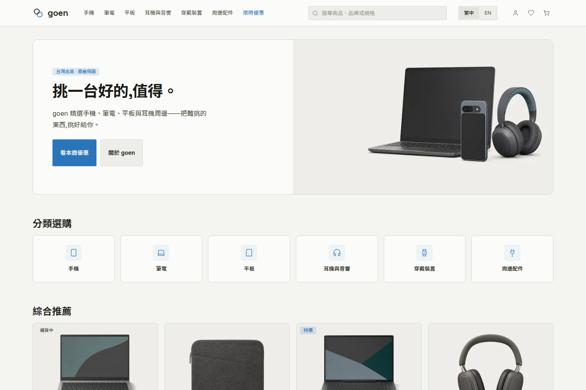

# goen

[繁體中文](README.zh-TW.md)

goen is one Go binary for a Taiwanese 3C shop. It serves the storefront,
customer accounts and the back office over PostgreSQL, takes cards at Stripe,
and files 統一發票 through 綠界. It is a demonstration and reference project,
not a hosted service.



## Run it

You need Go 1.27, Docker, and `psql`.

```sh
cp .env.example .env
make db-up        # PostgreSQL in Docker on 127.0.0.1:5433
make migrate-up
make db-seed      # without a catalogue the storefront is correct and empty
make run          # http://127.0.0.1:9700
```

Stripe is optional. With no key the site still sells and the payment page says
so.

## What holds

Four boundaries are enforced in the tree, not by convention:

- **Every mutation is a plain form.** A write is `<form method="post">` and
  answers `303 See Other` so a reload cannot resubmit. A validation refusal
  re-renders at `422` with the submitted values intact, except the signed-in
  Q&A ask, which still redirects and drops the draft
  ([#154](https://github.com/Koopa0/goen/issues/154)). htmx changes what comes
  back, never whether the write happens.
- **The database enforces what it can.** 316 `CHECK` constraints, 90 foreign keys,
  75 unique indexes and 46 rule triggers, with money and stock writable only
  through `SECURITY DEFINER` functions the application role may execute but not
  bypass. The conformance suite derives what it must cover from the system
  catalogue, so a constraint added without a test fails the build.
- **Chrome follows the reader; content follows the shop.** Navigation, labels
  and validation are translated. Product copy is translated only where the shop
  has actually written it.
- **The design system is vendored.** `assets/css/ds/` is fixed upstream;
  `assets/css/app/app.css` owns page composition only.

Pages are server-rendered HTML. [htmx](https://htmx.org) and a small native
`assets/js/goen.js` enhance them. There is no client framework, no Node runtime,
and no JavaScript build.

## Status

A local clone can browse, compare, cart, check out as a guest or an account,
open the payment page, request a return, register a warranty, and run `/admin`
behind a second factor.

Card capture, 統一發票 filing and outbound mail are implemented against their
providers. They have not been accepted against live Stripe, 綠界 or SMTP
endpoints ([#40](https://github.com/Koopa0/goen/issues/40)).

The advertised 7-day and 14-day return windows live in policy copy. The return
decision path does not yet enforce them
([#50](https://github.com/Koopa0/goen/issues/50)).

Observability, delayed payment methods and a search projection for short CJK
queries are not built. Each is a decision rather than an omission.

## Architecture

The project is organised by feature. `cmd/goen` is wiring;
`internal/<feature>` holds a feature's types, handlers, queries and tests
together. There is no `services`, `repositories` or `models` directory.

[CONTRIBUTING.md](CONTRIBUTING.md) has the four boundaries, the gate, and how
to change generated `internal/db` and `*_templ.go` files.

## Verify

```sh
make verify       # format, generate, vet, lint, build and race tests
make verify-all   # verify, plus the database suite and govulncheck
make test-integration
make check-layout # layout and accessibility in a real browser
```

`make verify` needs `golangci-lint` and `squawk` on `PATH`; every other tool is
pinned in the `Makefile` and fetched by `go run`. The integration suite needs
Docker. `make check-layout` needs Chrome and a running server.

## Configuration

Configuration is environment-only; [`.env.example`](.env.example) documents
every variable. `GOEN_DATABASE_URL` is required and has no default.

Four combinations refuse to start, each because the alternative is worse than
not running:

| Setting | Refused when |
| --- | --- |
| `GOEN_STRIPE_API_KEY` | set without `GOEN_STRIPE_WEBHOOK_SECRET` — money over an endpoint nothing authenticates |
| `GOEN_TOTP_KEY` | not exactly 32 bytes of hex or base64 — it is a key, not a passphrase |
| `GOEN_SMTP_ADDR` | empty while cookies are Secure — resets would be marked sent and never leave |
| `GOEN_BASE_URL` | not a root HTTPS origin in a production posture — a cleartext reset link leaks its token |

## Contributing

Issues and pull requests are welcome. [CONTRIBUTING.md](CONTRIBUTING.md) is
the contributor manual. Security problems go through the
[private advisory form](https://github.com/Koopa0/goen/security/advisories/new),
never a public issue. See [SECURITY.md](.github/SECURITY.md).

## License

Apache License 2.0. See [LICENSE](LICENSE).

## Disclaimer

This is a demonstration and reference project. It is not affiliated with any
company and is not an officially supported product.
