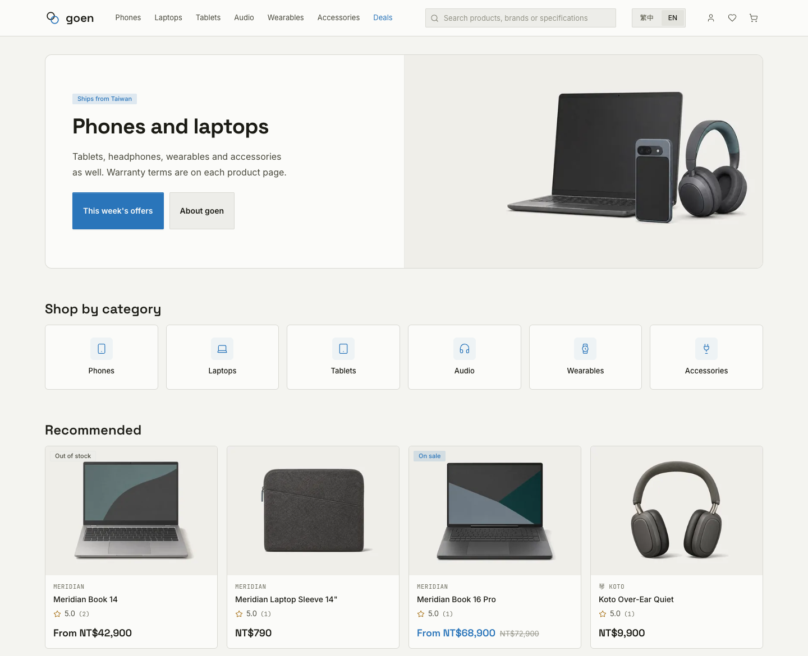

# goen

English | [繁體中文](README.zh-TW.md)

goen is an e-commerce project for shoppers and shop operators. Browse and compare
products, place an order, manage purchases, and handle fulfilment from the back office.
It is a demonstration and reference project, not a hosted service.

## Shopping

Browse categories, search products, compare specifications side by side, and save
items to a wishlist. Product pages include variants, reviews and questions.
Check out as a guest or member, choose home delivery or convenience-store pickup,
and apply discount codes.

## Orders and after-sales support

Look up an order, follow its status, buy the same items again, request a return,
or register a warranty. Members can also manage their profile and addresses,
and exchange reward points for store credit.

## Running the shop

The back office covers products and stock, promotions, order fulfilment, returns
and refunds, warranty requests, invoices and customer enquiries.

## Current limits

Payments, electronic invoices and email delivery still need acceptance with their
external services ([#40](https://github.com/Koopa0/goen/issues/40)). The return review
process does not yet enforce the advertised eligibility windows
([#50](https://github.com/Koopa0/goen/issues/50)). Warranty collection is incomplete
for convenience-store pickup orders ([#225](https://github.com/Koopa0/goen/issues/225)).

The interface is available in English and Traditional Chinese. Product content
uses the translations supplied by the shop.

## Project information

- [Setup and contributing](CONTRIBUTING.md)
- [Report a security issue](.github/SECURITY.md)
- [Apache License 2.0](LICENSE)
