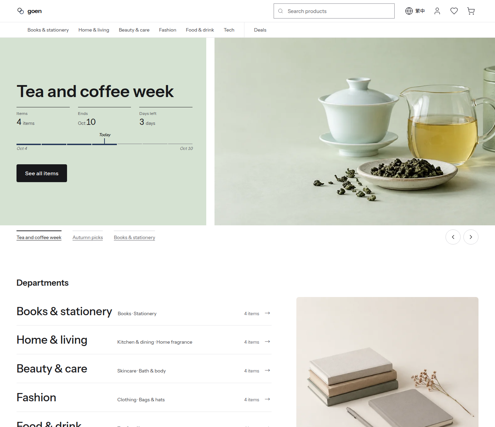

<h1> goen</h1>

English | [繁體中文](README.zh-TW.md)

[](https://github.com/Koopa0/goen/actions/workflows/verify.yml)
[](go.mod)
[](LICENSE)

A complete e-commerce shop built with Go — from browsing to checkout, after-sales and the back office that runs it.

**Live demo: [goen.koopa0.dev](https://goen.koopa0.dev)**



## Features

**Shopping**
- Departments and categories with filters, sorting and search
- Product variants, reviews, questions and side-by-side comparison
- Wishlist, and a store in Traditional Chinese and English

**Checkout**
- Guest or member checkout, home delivery or convenience-store pickup
- Card payments through Stripe; coupons and store credit
- E-invoices issued automatically through ECPay

**After the order**
- Order tracking, returns within the seven-day period, warranty registration
- Reward points that turn into store credit

**Back office**
- Orders, fulfilment, returns and refunds
- Products, stock, pricing, campaigns and the home page
- Customers, reviews and questions; staff sign-in with two-factor codes and an audit log

## Built with

Go · templ · htmx · PostgreSQL · Stripe · ECPay

How it holds together — database roles, the rules the database enforces and the checks behind them: [ARCHITECTURE.md](ARCHITECTURE.md)

## Try the demo

Sign in with the demo account shown on the sign-in page, and pay with Stripe's test card 4242 4242 4242 4242.

To give your own copy 90 days of past orders, run this once, with goen stopped, on a database built by `make db-seed` that has an admin account:

```sh
psql "$GOEN_DATABASE_URL" -X -v ON_ERROR_STOP=1 -v demo_database=<its name> -f seed/demo_history.sql
```

Stripe and ECPay never saw those orders, so refunding one, voiding its invoice or issuing an allowance from the back office fails at their sandbox, like any request they reject. The seeded returns come without an allowance (折讓), and their invoice numbers use a made-up DM track, since goen accepts only numbers shaped like a real 統一發票 number.

If you keep that database as a snapshot and restore it on a later day, its history no longer ends yesterday. After each restore, before goen starts, move it to today by naming the day the snapshot was taken; a second run on the same restore is refused:

```sh
psql "$GOEN_DATABASE_URL" -X -v ON_ERROR_STOP=1 -v demo_database=<its name> -v anchor_day=<YYYY-MM-DD> -f seed/demo_shift.sql
```

The seed's two campaigns run from 20 and 3 days before the day it ran until 10 and 4 days after, so a local database seeded longer ago shows none running: rebuild it with `make db-reset`, or move it to today the same way, naming the day it was seeded.

## Run it locally

You need Go 1.27, Docker and `psql`.

```sh
cp .env.example .env
make db-up
make migrate-up
make db-seed
make run          # http://127.0.0.1:9700
```

See [CONTRIBUTING.md](CONTRIBUTING.md) for tests and configuration.

## License

[Apache License 2.0](LICENSE). Security reports: [SECURITY.md](.github/SECURITY.md).
