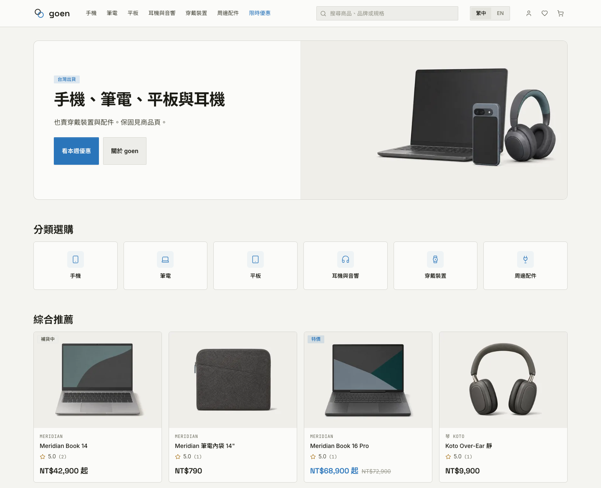

# goen

[English](README.md) | 繁體中文

goen 是電商示範與參考專案，提供買家瀏覽比價、下單與管理訂單，也讓店家透過後台
處理商品與出貨。專案不提供代管服務。

## 選購商品

依分類瀏覽或搜尋商品、並排比較規格，將感興趣的商品加入願望清單。
商品頁提供款式選擇、評價與問答。訪客與會員都能結帳，選擇宅配或超商取貨，
使用優惠碼折抵。

## 訂單與售後

查詢訂單、追蹤處理進度、再次購買、申請退貨與登錄保固。會員也能管理個人資料、
地址，並以點數兌換購物金。

## 店家後台

管理商品、庫存與促銷，處理訂單出貨、退貨退款、保固申請、發票與顧客詢問。

## 目前限制

付款、電子發票與寄信仍待外部服務驗收
（[#40](https://github.com/Koopa0/goen/issues/40)）。退貨審核尚未落實公告的申請期限
（[#50](https://github.com/Koopa0/goen/issues/50)）；超商取貨訂單的保固收件流程也尚未完整
（[#225](https://github.com/Koopa0/goen/issues/225)）。

介面提供繁體中文與英文；商品內容依店家提供的譯文顯示。

## 專案資訊

- [安裝與參與貢獻](CONTRIBUTING.md)
- [回報安全性問題](.github/SECURITY.md)
- [Apache License 2.0](LICENSE)
