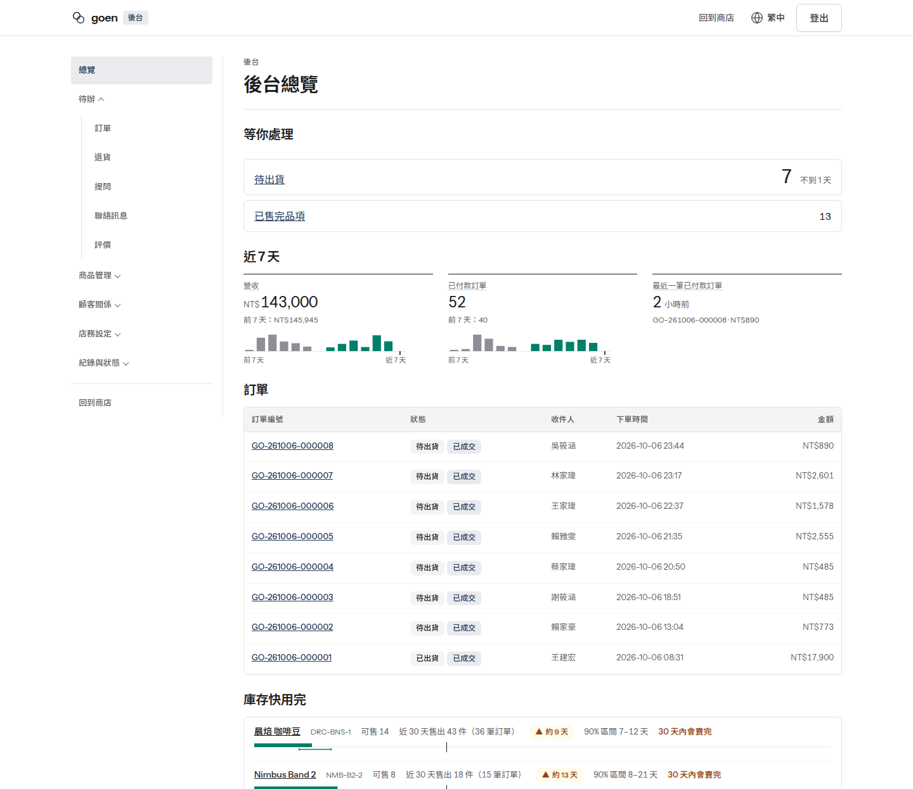

<h1> goen</h1>

[English](README.md) | 繁體中文

[](https://github.com/Koopa0/goen/actions/workflows/verify.yml)
[](go.mod)
[](LICENSE)

用 Go 打造的完整電商專案：從瀏覽、結帳、售後服務，到經營商店的後台。

**示範站：[goen.koopa0.dev](https://goen.koopa0.dev)**




## 功能

**購物**
- 館別與分類，支援篩選、排序與搜尋
- 商品規格、評論、問答與並排比較
- 收藏清單，介面提供繁體中文與英文

**結帳**
- 訪客或會員結帳，宅配或超商取貨
- Stripe 信用卡付款，折扣碼與購物金
- 綠界電子發票自動開立

**售後**
- 訂單查詢、七天猶豫期內退貨、保固登錄
- 會員點數可兌換購物金

**後台**
- 訂單、出貨、退貨與退款
- 商品、庫存、價格、活動與首頁管理
- 顧客、評論與問答；員工兩步驟驗證登入與操作紀錄

## 技術

Go · templ · htmx · PostgreSQL · Stripe · 綠界

系統怎麼分工、資料庫守住哪些規則、背後有哪些檢查：[ARCHITECTURE.zh-TW.md](ARCHITECTURE.zh-TW.md)

## 試用示範站

用登入頁上的示範帳號登入，付款時使用 Stripe 測試卡 4242 4242 4242 4242。

## 在本機執行

需要 Go 1.27、Docker 與 `psql`。

```sh
cp .env.example .env
make db-up
make migrate-up
make db-seed
make run          # http://127.0.0.1:9700
```

測試與設定請見 [CONTRIBUTING.md](CONTRIBUTING.md)。

## 授權

[Apache License 2.0](LICENSE)。安全性問題請依 [SECURITY.md](.github/SECURITY.md) 回報。
